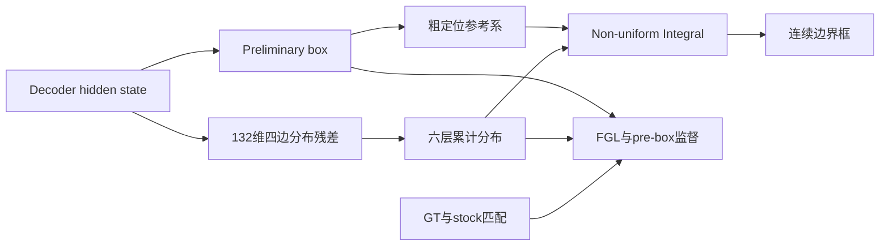
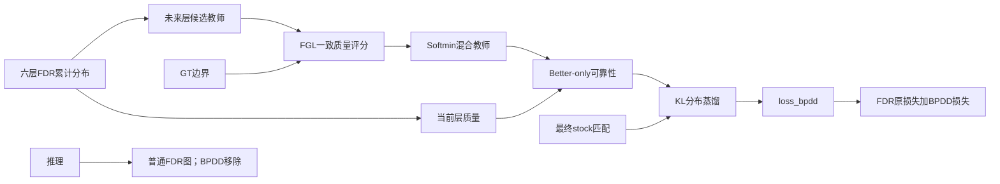

# RT-DETR-L 无人机小目标检测：CCF B 类论文材料总表

> 更新时间：2026-08-10（Asia/Shanghai）<br>
> 推荐用途：论文选题、方法章节、实验章节、消融设计和交接的唯一优先入口<br>
> 机器可读权威：[authority-index.json](../evidence/paper-master-2026-08-10/authority-index.json)<br>
> 文档状态索引：[document-status.csv](../evidence/paper-master-2026-08-10/document-status.csv)

## 0. 使用规则

本文件汇总截至 2026-08-10 已经能够由代码、冻结协议、检查点、独立评估或 GitHub Release 支撑的最新材料。旧交接文档和失败路线保留在仓库中，但其叙述性结论若与本文件冲突，以本文件及机器可读权威为准。

证据分为三档：

| 标记 | 含义 | 可否作为正文最终结论 |
|---|---|---|
| 严格 | 同协议、同数据、同评估器，完成规定训练 | 可以，但仍需遵守 seed 和 artifact 边界 |
| 初步 | 指标真实，但比较存在 cross-authority、单臂或其他未封口条件 | 只能写成初步证据 |
| 历史 | 失败实验、机制探针、GT oracle 或外部截图 | 只能放附录或研究动机 |

不得把“真实运行过”自动等同于“论文级严格证据”。

---

## 1. 一页结论

### 1.1 当前最成熟结果

当前最成熟主线是：

```text
Ultralytics RT-DETR-L
        +
FDR/FGL/preliminary-box 定位路径
        +
训练期 BPDD 可靠渐进边界分布蒸馏
```

成熟度判断：

| 内容 | 当前状态 | 结论 |
|---|---|---|
| stock Control → FDR | 全数据、seed0、100 epoch、same-evaluator | 严格正向；mAP50-95 `+7.055 pp` |
| FDR → BPDD Screen30 | 固定10%子集、seed0、严格配对30 epoch | 通过；final mAP `+0.189 pp` |
| FDR → BPDD Formal100 | BPDD单臂100 epoch完成；对照使用既有严格FDR100 | 初步正向；mAP `+0.260 pp`、AP75 `+0.557 pp` |
| fresh paired FDR/BPDD Formal100 | fresh FDR在epoch24按用户要求停止 | 未完成，不能伪装成严格配对 |
| 多seed | 只有seed0 | 未完成 |
| 第三个原创模块 | 尚无冻结成功候选 | 未完成 |

### 1.2 当前可投稿程度

- **FDR实验结论较成熟。** 同一 formal authority 的 Control 和 FDR 都完成100轮，并经统一评估；四尺度和十类别的mAP/AP50/AP75均正向。
- **FDR原创性需要保守。** 基础FDR、FGL和Integral来自D-FINE；当前项目可主张的是Ultralytics RT-DETR-L/VisDrone适配、隔离集成、YAML模块化和严格验证，不能把基础公式写成原创。
- **BPDD是有正向证据的训练期候选创新。** 它具备完整算法流程、独立实现和YAML开关，但Formal100与FDR的比较仍是跨权威初步比较。
- **BPDD必须直接对比D-FINE GO-LSD。** 二者同属FDR跨层定位蒸馏；没有同协议GO-LSD对照，审稿人可能认为BPDD只是其保守变体。
- **当前还不满足“三个均已验证创新点”。** 第三个原创模块尚未冻结，FrequencyCM、SCADS、GLGM等不能移入正文贡献列表。

---

## 2. 论文问题与应用叙事

### 2.1 生活场景

论文建议以城市道路无人机巡检为主场景：无人机在交通拥堵监测、事故排查和应急搜救中需要从较高视角覆盖大范围区域，远处行人、非机动车和车辆只占少量像素，并受到遮挡、运动模糊、密集排列、复杂地面纹理和视角变化影响。

一个 `6×10` 像素目标若水平方向偏移1像素，即使框大小不变，其IoU也只有：

\[
\operatorname{IoU}=\frac{5\times10}{6\times10+6\times10-5\times10}=0.714.
\]

这说明对大目标可能可以忽略的像素误差，会让极小目标直接无法满足IoU=0.75的严格定位要求。准确边界还会影响区域入侵、车道占用、目标计数和后续跟踪关联；这些属于应用动机，本项目尚未对下游任务进行独立验证，因此不能写成已证实的下游收益。

### 2.2 本文真正解决的范围

本文不应声称全面解决复杂背景、遮挡和漏检。FDR与BPDD主要面向：

> RT-DETR已经形成目标Query，但边界表示粒度不足，且多层边界分布学习不够可靠的问题。

对应的两层技术问题为：

| 层次 | 痛点 | 方法 |
|---|---|---|
| 定位表示 | 小目标对像素偏移高度敏感，连续四维点估计难以表达边界不确定性 | FDR |
| 多层优化 | 后续Decoder层不一定对每个Query和每条边都更可靠，固定教师可能负迁移 | BPDD |
| 部署成本 | 无人机检测需要控制推理开销 | FDR仅小幅增量；BPDD推理时移除 |

---

## 3. 基础模型与统一协议

### 3.1 环境和数据

| 项目 | 冻结值 |
|---|---|
| 基础模型 | Ultralytics RT-DETR-L |
| Ultralytics | 8.4.90 |
| GPU | NVIDIA GeForce RTX 4090，24GB |
| 驱动 | 550.142 |
| Python | 3.10.12 |
| PyTorch / Torchvision | 2.5.1+cu121 / 0.20.1+cu121 |
| CUDA | 12.1 |
| 数据集 | VisDrone，同一train/val |
| 训练/验证图片 | 6471 / 548 |
| 验证目标 | 38,759 |
| 类别数 | 10 |
| 数据集SHA256 | `FD92E9FF4B3B58FCDD5A32F7E770FC3398E566B627DB0E188CB5FF9F3B7BBDAB` |
| 固定10%子集 | 647张 |
| 子集SHA256 | `52660F55552FFD953E2EE26F55FD0A1CB14217DBBEA0F5F3B981C3514F8D93A0` |

### 3.2 训练和推理协议

| 项目 | 冻结值 |
|---|---|
| 初始化 | `pretrained=False`，从零训练 |
| 正式训练 | 100 epoch |
| Screen | 固定10%子集，30 epoch |
| imgsz / batch / workers | 640 / 8 / 8 |
| device | 0，单卡 |
| AMP | True，固定scale 128 |
| seed / deterministic | 0 / True |
| optimizer | MuSGD |
| lr0 / lrf | 0.01 / 0.01 |
| momentum / weight decay | 0.937 / 0.0005 |
| warmup epochs / momentum / bias lr | 3.0 / 0.8 / 0.0 |
| nbs / cos_lr | 64 / False |
| Query数 | 300 |
| NMS / max_det | False / 300 |
| mosaic / close_mosaic | 1.0 / 10 |
| mixup / cutmix / copy_paste | 0 / 0 / 0 |
| scale / translate / fliplr | 0.5 / 0.1 / 0.5 |

完整字段见[机器可读权威](../evidence/paper-master-2026-08-10/authority-index.json)。

---

## 4. 创新点一候选：FDR定位路径适配

### 4.1 原创性边界

FDR基础机制来自D-FINE：

- 论文：[D-FINE: Redefine Regression Task in DETRs as Fine-grained Distribution Refinement](https://arxiv.org/abs/2410.13842)
- 官方实现：[Peterande/D-FINE](https://github.com/Peterande/D-FINE)

当前项目没有移植完整D-FINE，也没有引入GO-LSD、DDF、GELAN或D-FINE的全部训练策略。可主张内容是：

1. 面向Ultralytics 8.4.90 RT-DETR-L的定位路径重构；
2. 面向VisDrone小目标场景的配置和协议适配；
3. stock分类、Query选择、匹配和后处理隔离不变；
4. YAML可插拔与Control/FDR消融兼容；
5. 统一协议的Screen30与Formal100验证。

不能主张“本文首次提出FDR/FGL/Integral”。

### 4.2 网络改动

stock RT-DETR-L每个Decoder层直接输出四维连续框。FDR版本进行以下改动：

1. 六个4维连续回归头替换为六个132维分布回归头；
2. 每条边使用`reg_max=32`，即33个分箱，四边共132维；
3. 增加preliminary box，建立粗定位参考；
4. 六层分布残差在同一参考系中累计；
5. 通过非均匀Integral将边界分布恢复为连续距离；
6. 训练阶段增加FGL和preliminary-box L1/GIoU监督。

核心配置：[rtdetr-l-fdr.yaml](../configs/rtdetr-l-fdr.yaml)。<br>
定位头：[fdr_head.py](../src/fdr_head.py)。<br>
损失：[fdr_loss.py](../src/fdr_loss.py)。<br>
数学变换：[fdr_math.py](../src/fdr_math.py)。<br>
模型接入：[rtdetr_fdr.py](../src/rtdetr_fdr.py)。

### 4.3 FDR流程



### 4.4 实际实验臂定义

当前FDR臂是完整组合：

```text
FDR分布表示 + cumulative refinement + preliminary box
              + FGL(0.15) + pre-box L1/GIoU
```

因此Formal100不能单独证明其中某一个子组件的贡献，必须补充no-cumulative、no-FGL、no-prebox和no-prebox-loss消融。

---

## 5. 创新点二候选：BPDD训练期蒸馏模块

### 5.1 模块定位

BPDD是**参数为零、仅训练期启用的边界概率分布蒸馏模块**。它不是新增推理检测头，也不是后处理算法。完整功能单元位于[bpdd_loss.py](../src/bpdd_loss.py)，YAML和训练器接入位于[rtdetr_fdr_bpdd.py](../src/rtdetr_fdr_bpdd.py)。

配置入口：[rtdetr-l-fdr-bpdd.yaml](../configs/rtdetr-l-fdr-bpdd.yaml)：

```yaml
bpdd_loss:
  enabled: true
  weight: 0.5
  temperature: 0.5
  margin: 0.02
  eps: 1.0e-6
  matched_layer: final
  include_dn: false
```

### 5.2 解决的问题

FDR改善了边界表示，但各Decoder层仍主要接受独立监督。后续层整体上可能更准确，却不保证对每个Query、每条边和每个训练阶段都更好。固定使用最后层进行蒸馏可能传递退化分布。

BPDD的核心问题是：

> 如何只利用后续Decoder层中真实优于当前层的边界知识，同时避免改变目标分配和推理图？

### 5.3 教师构造和可靠性门控

对于第`l`层，以其后所有层作为候选教师。按照与FGL一致的GT两相邻分箱proper score进行Softmin加权：

\[
T_l=\sum_{k=l+1}^{L}\alpha_{lk}P_k,
\qquad
\alpha_{lk}=\frac{\exp(-S(P_k,y)/\tau)}{\sum_{j=l+1}^{L}\exp(-S(P_j,y)/\tau)}.
\]

评价的是实际混合教师`T_l`，而不是候选误差的平均值。只有教师比当前层好并超过margin时才启用可靠性权重：

\[
r_l=\max\left(0,\frac{S(P_l,y)-S(T_l,y)-\delta}{S(P_l,y)+\epsilon}\right).
\]

教师和门控均detach，蒸馏损失只更新学生层：

\[
\mathcal L_{BPDD}=\lambda\operatorname{mean}_{q,e,l}
\left[r_l\operatorname{KL}(T_l\Vert P_l)\right].
\]

### 5.4 隔离原则

BPDD只复用最终Decoder的stock Hungarian匹配：

- 只监督已匹配normal Query；
- 不重新调用matcher；
- 不构造跨层匹配并集；
- 不监督unmatched Query；
- v1不包含DN Query；
- 不改变分类分数、Top-300、NMS或最终框；
- 关闭`enabled`或将`weight=0`时返回纯FDR损失映射；
- BPDD训练后的checkpoint可由普通FDR推理图加载。

### 5.5 与D-FINE GO-LSD的关系

GO-LSD是BPDD最接近的已知方法。两者都进行FDR定位分布的later-to-earlier自蒸馏，并且都无额外推理分支。主要区别：

| 维度 | D-FINE GO-LSD | BPDD |
|---|---|---|
| 教师 | 固定最终层 | 当前层之后全部未来层的质量加权混合 |
| 质量判断 | 默认最终层作为全局教师 | GT一致的逐边proper score |
| better-only门控 | 无显式教师必须更好门槛 | 混合教师超过当前层和margin才启用 |
| 匹配 | 多层/Encoder/pre匹配并集 | 仅复用一次最终stock匹配 |
| Query范围 | 匹配和未匹配预测 | 仅已匹配normal Query |
| DN | 官方路径包含对应辅助项 | v1排除 |
| 设计取向 | 全局覆盖 | 风险控制和隔离 |

这一区别只能支持“风险受控的具体重构”，不能支持“首次提出定位自蒸馏”。最终论文必须加入同协议GO-LSD直接对照。

### 5.6 BPDD训练与推理流程



---

## 6. Control与FDR严格Formal100结果

### 6.1 总体指标

证据状态：**严格同协议、同评估器、全数据seed0 100 epoch**。完整报告见[FDR严格Control结果](FDR_RTDETR_L_STRICT_CONTROL_AND_RESULTS_2026-08-09_ZH.md)。

| 指标 | Control | FDR | FDR-Control | 状态 |
|---|---:|---:|---:|---|
| Precision | 0.46761 | 0.56911 | +10.150 pp | 严格 |
| Recall | 0.41731 | 0.49278 | +7.547 pp | 严格 |
| F1（旧evaluator字段） | 0.43657 | 0.52484 | +8.827 pp | 口径待封口 |
| F1（聚合P/R谐均值） | 0.44103 | 0.52820 | +8.717 pp | 推导值 |
| AP50 | 0.38663 | 0.48468 | +9.805 pp | 严格 |
| AP75 | 0.21302 | 0.29253 | +7.951 pp | 严格 |
| mAP50-95 | 0.21911 | 0.28966 | **+7.055 pp** | 严格 |

#### F1口径审计

旧严格报告中的F1不等于展示的聚合Precision和Recall的直接谐均值，可能涉及类别聚合顺序或内部全精度字段。投稿表格必须明确采用一种定义并重新导出，不得混用旧evaluator F1与按聚合P/R推导的F1。

### 6.2 分尺度指标

尺度定义：Tiny `<256 px²`；Small `[256,1024)`；Medium `[1024,9216)`；Large `≥9216 px²`。

| 尺度 | GT | Control mAP | FDR mAP | ΔmAP | Control AP50 | FDR AP50 | Control AP75 | FDR AP75 |
|---|---:|---:|---:|---:|---:|---:|---:|---:|
| Tiny | 20,861 | 0.08684 | 0.14480 | +5.796 pp | 0.20242 | 0.30322 | 0.06019 | 0.11485 |
| Small | 12,420 | 0.21784 | 0.28998 | +7.214 pp | 0.37701 | 0.46100 | 0.22544 | 0.31944 |
| Medium | 5,348 | 0.32499 | 0.39630 | +7.131 pp | 0.46969 | 0.54957 | 0.35851 | 0.44447 |
| Large | 130 | 0.31822 | 0.38608 | +6.786 pp | 0.39276 | 0.45976 | 0.35713 | 0.38931 |

### 6.3 十类别指标

| 类别 | Control mAP | FDR mAP | ΔmAP | Control AP50 | FDR AP50 | Control AP75 | FDR AP75 |
|---|---:|---:|---:|---:|---:|---:|---:|
| pedestrian | 0.17638 | 0.27277 | +9.639 pp | 0.41722 | 0.56665 | 0.11627 | 0.22404 |
| people | 0.13004 | 0.20888 | +7.884 pp | 0.33741 | 0.49829 | 0.06693 | 0.13556 |
| bicycle | 0.05132 | 0.11044 | +5.912 pp | 0.12410 | 0.23732 | 0.02806 | 0.08441 |
| car | 0.54785 | 0.60930 | +6.145 pp | 0.80905 | 0.85692 | 0.60952 | 0.68546 |
| van | 0.31458 | 0.37972 | +6.514 pp | 0.46538 | 0.53207 | 0.35274 | 0.43397 |
| truck | 0.21277 | 0.26403 | +5.126 pp | 0.34079 | 0.39085 | 0.22671 | 0.28742 |
| tricycle | 0.12815 | 0.20574 | +7.759 pp | 0.24221 | 0.36624 | 0.12539 | 0.19978 |
| awning-tricycle | 0.08782 | 0.11370 | +2.588 pp | 0.14871 | 0.18469 | 0.09283 | 0.12190 |
| bus | 0.34460 | 0.43801 | +9.341 pp | 0.51086 | 0.60786 | 0.38279 | 0.50753 |
| motor | 0.19754 | 0.29401 | +9.647 pp | 0.47060 | 0.60595 | 0.12896 | 0.24518 |

### 6.4 参数与计算量

| 指标 | Control | FDR | 增量 |
|---|---:|---:|---:|
| 参数量 | 32,826,626 | 33,156,614 | +329,988（+1.00524%） |
| GFLOPs | 108.0318976 | 108.2291200 | +0.1972224（+0.18256%） |
| 严格同机FP16延迟 | 待测 | 待测 | 待封口 |

### 6.5 Artifact边界

- same-evaluator结果JSON SHA256：`8FFD439C4C48044C0D1937019CE58DDB857CE8FCED64C0082CBC28EDD44333E8`；
- Control统一复评`last.pt`：`7CCDAE649426505F157CB78AEBAA1981CDABB28B483338743983D2A264B50E4F`；
- FDR统一复评`last.pt`：`2C1ADE3FD9DC59B8FE5B816B8B95183037E47839186BB8F68C93774B0B60451A`；
- Release epoch100哈希与实际复评`last.pt`不同，尚无tensor-by-tensor equality报告；
- 这属于artifact identity未封口，不等同于需要重跑seed0训练。

---

## 7. BPDD实验结果

### 7.1 严格配对Screen30

| 指标 | BPDD-FDR | 证据状态 |
|---|---:|---|
| final mAP50-95 | +0.001890（+0.189 pp） | 严格配对Screen30 |
| final AP75 | +0.001846（+0.185 pp） | 严格配对Screen30 |
| tail3 mAP50-95 | +0.000557（+0.056 pp） | 严格配对Screen30 |

三项均严格正向，因此通过预注册Screen Gate。Screen只用于候选筛选，不能替代Formal100效应量。

### 7.2 BPDD Formal100独立评估

BPDD已完成全数据seed0 100/100 epoch，逐epochpublication ledger为100/100，独立评估使用官方548张val和exact final EMA。公开报告：

[bpdd-formal-848f00cb-independent-eval.json](https://github.com/kkc236/uav-detection-baselines/releases/download/bpdd-formal-848f00cb-live/bpdd-formal-848f00cb-independent-eval.json)

| 指标 | 既有严格FDR100 | BPDD100 | BPDD-FDR | 证据状态 |
|---|---:|---:|---:|---|
| Precision | 0.569113 | 0.570634 | +0.152 pp | 初步跨权威 |
| Recall | 0.492777 | 0.494464 | +0.169 pp | 初步跨权威 |
| F1（均按聚合P/R推导） | 0.528201 | 0.529825 | +0.162 pp | 初步跨权威 |
| AP50 | 0.484684 | 0.486407 | +0.172 pp | 初步跨权威 |
| AP75 | 0.292526 | 0.298096 | **+0.557 pp** | 初步跨权威 |
| mAP50-95 | 0.289660 | 0.292258 | **+0.260 pp** | 初步跨权威 |

以上所有总体指标为正，但fresh FDR Formal100在epoch24按用户要求停止，因此不能写成严格paired Formal100。

### 7.3 BPDD分尺度结果

| 尺度 | BPDD mAP | 相对FDR ΔmAP | BPDD AP50 | ΔAP50 | BPDD AP75 | ΔAP75 | 状态 |
|---|---:|---:|---:|---:|---:|---:|---|
| Tiny | 0.14464 | -0.017 pp | 0.30294 | -0.028 pp | 0.12141 | +0.656 pp | 初步 |
| Small | 0.29776 | +0.778 pp | 0.46778 | +0.678 pp | 0.32912 | +0.968 pp | 初步 |
| Medium | 0.39666 | +0.036 pp | 0.54395 | -0.562 pp | 0.44868 | +0.421 pp | 初步 |
| Large | 0.37685 | -0.923 pp | 0.44571 | -1.405 pp | 0.39571 | +0.640 pp | 初步；仅130 GT |

BPDD不能写成“四尺度全面上涨”。更符合数据的结论是：Small提升最明显，四尺度AP75均正向，但Tiny总体mAP近乎持平，Large总体mAP下降且样本很少。

### 7.4 BPDD十类别结果

| 类别 | BPDD mAP | 相对FDR ΔmAP | BPDD AP50 | ΔAP50 | BPDD AP75 | ΔAP75 |
|---|---:|---:|---:|---:|---:|---:|
| pedestrian | 0.27318 | +0.041 pp | 0.56321 | -0.344 pp | 0.22726 | +0.322 pp |
| people | 0.21168 | +0.280 pp | 0.50326 | +0.497 pp | 0.13837 | +0.281 pp |
| bicycle | 0.10527 | -0.517 pp | 0.22153 | -1.579 pp | 0.08819 | +0.378 pp |
| car | 0.61307 | +0.377 pp | 0.85923 | +0.231 pp | 0.68879 | +0.333 pp |
| van | 0.37323 | -0.649 pp | 0.52449 | -0.758 pp | 0.42297 | -1.100 pp |
| truck | 0.27424 | +1.021 pp | 0.40416 | +1.331 pp | 0.30078 | +1.336 pp |
| tricycle | 0.20867 | +0.293 pp | 0.36253 | -0.371 pp | 0.21597 | +1.619 pp |
| awning-tricycle | 0.12052 | +0.682 pp | 0.19471 | +1.002 pp | 0.12786 | +0.596 pp |
| bus | 0.44789 | +0.988 pp | 0.62073 | +1.287 pp | 0.52472 | +1.719 pp |
| motor | 0.29484 | +0.083 pp | 0.61023 | +0.428 pp | 0.24604 | +0.086 pp |

BPDD初步比较中8/10类别mAP正向，van和bicycle下降；AP75为9/10类别正向，van下降。不能写成“十类别全面提升”。

### 7.5 BPDD开销和检查点

| 项目 | 结果 |
|---|---|
| 模块类型 | 训练期、参数为零的辅助损失 |
| 推理图 | 普通FDR |
| 推理参数增量 | 0 |
| 推理GFLOPs增量 | 0 |
| 严格同机FP16延迟 | 待封口 |
| BPDD checkpoint SHA256 | `E8342C208CE9F5AA8A5F1B341A168170C7D4551E10730E08F05B9794E57CCE4B` |
| final EMA state SHA256 | `1C19C1A124AD1058650CAC0EECA1E7E1B41143A7F35D3EDA6B25854A94476454` |
| 最近完整回归 | commit `2997705c`，129项BPDD测试通过 |

---

## 8. 可直接用于论文的材料

### 8.1 保守摘要事实块

可作为后续摘要的事实底稿，但在补齐BPDD严格配对和GO-LSD对照前不应直接作为最终摘要：

> 针对无人机俯视场景中小目标边界像素少、定位误差敏感的问题，本文基于Ultralytics RT-DETR-L构建细粒度边界分布回归框架。首先，将Decoder连续框回归路径适配为四边概率分布累计细化形式，并引入preliminary box与FGL监督，以提高边界表示粒度。其次，设计训练期可靠渐进边界概率分布蒸馏模块BPDD，利用未来Decoder层构造质量加权软教师，并仅在混合教师优于当前层时执行蒸馏。VisDrone seed0实验中，FDR相对严格Control的mAP50-95提高7.055个百分点；BPDD在完整100轮单臂独立评估中进一步取得0.260个百分点的初步mAP增益和0.557个百分点的AP75增益。BPDD不改变FDR推理图。后续仍需完成fresh配对、多seed和GO-LSD同协议比较。

### 8.2 贡献槽位

| 槽位 | 当前写法 | 成熟度 |
|---|---|---|
| 贡献1 | D-FINE FDR/FGL面向Ultralytics RT-DETR-L和VisDrone的结构化适配、隔离集成与统一验证 | 实验成熟；基础公式非原创 |
| 贡献2 | future-only软教师、GT一致评分、better-only可靠性和最终匹配隔离组成的BPDD | 有初步Formal100正收益；需GO-LSD与strict pair |
| 贡献3 | 尚未冻结 | 不得用失败模块填充 |

如果投稿必须强调原创算法，贡献1应写成“适配与系统化验证”而非基础算法原创；论文原创中心应落在BPDD及未来第三模块。

### 8.3 方法章节建议

```text
3.1 Overall Architecture
3.2 Fine-grained Distribution Regression Adaptation
    3.2.1 Preliminary Box and Distribution Representation
    3.2.2 Cumulative Boundary Refinement
    3.2.3 FGL and Auxiliary Supervision
3.3 Better-Progressive Distribution Distillation
    3.3.1 Future-layer Teacher Candidates
    3.3.2 GT-aligned Softmin Teacher Mixture
    3.3.3 Better-only Reliability Gate
    3.3.4 Isolated Matching and Training Objective
3.4 Training and Inference Complexity
```

### 8.4 实验章节建议

```text
4.1 Dataset, Metrics and Implementation Details
4.2 Comparison with Stock RT-DETR-L
4.3 Component Ablations of FDR
4.4 BPDD versus GO-LSD and Distillation Baselines
4.5 Scale-wise and Class-wise Analysis
4.6 Qualitative Localization Cases
4.7 Complexity, Latency and Limitations
```

### 8.5 必须制作的图

| 图 | 内容 | 证据要求 |
|---|---|---|
| Fig.1 | RT-DETR-L→FDR→BPDD总体框架 | 实际代码路径 |
| Fig.2 | 4维连续框头与132维分布头对比 | YAML和`fdr_head.py` |
| Fig.3 | FDR累计分布和Integral解码 | `fdr_math.py` |
| Fig.4 | BPDD未来层软教师与better-only gate | `bpdd_loss.py` |
| Fig.5 | FDR/Control四尺度增益 | strict report |
| Fig.6 | FDR/BPDD AP75跨越定性案例 | 必须按固定规则提取 |

### 8.6 Case筛选规则

为避免只挑最好看的图，固定以下规则：

1. FDR案例：按`IoU_FDR-IoU_Control`排序展示前三，并展示退化最大的两个；
2. BPDD AP75案例：`IoU_FDR∈[0.65,0.75)`且`IoU_BPDD≥0.75`；
3. Small案例：Small目标且`IoU_BPDD-IoU_FDR≥0.05`，分类置信度差异不超过0.05；
4. Gate案例：同时展示教师优于学生而开启、教师退化而关闭的训练样本；
5. 每个案例公开image id、类别、尺度、置信度和两模型IoU；
6. GT只用于训练期门控解释和离线可视化，不能描述为推理输入。

### 8.7 必须补的消融矩阵

#### FDR

| Arm | cumulative | FGL | pre-box结构 | pre-box loss |
|---|---:|---:|---:|---:|
| stock | 否 | 否 | 否 | 否 |
| FDR-no-cumulative | 否 | 是 | 是 | 是 |
| FDR-no-FGL | 是 | 否 | 是 | 是 |
| FDR-no-prebox-loss | 是 | 是 | 是 | 否 |
| FDR-no-prebox | 是 | 是 | 否 | 否 |
| full FDR | 是 | 是 | 是 | 是 |

现有配置已经提供对应YAML，但尚未形成同协议完整消融结论。

#### BPDD与GO-LSD

| Arm | 教师 | Gate | 匹配范围 | 目的 |
|---|---|---|---|---|
| FDR | 无 | 无 | stock | 基础对照 |
| FDR+official GO-LSD | 最终层 | 无better-only | union+unmatched | 最近相关方法 |
| fixed-final isolated | 最终层 | better-only | final matched only | 隔离教师来源 |
| future-mixture no gate | 未来层混合 | 无 | final matched only | 验证混合教师 |
| future-mixture hard gate | 未来层混合 | 二值 | final matched only | 验证门控形式 |
| full BPDD | 未来层混合 | 连续better-only | final matched only | 完整方法 |

### 8.8 可写与禁写

| 可以写 | 不能写 |
|---|---|
| FDR在严格seed0 Control下显著正向 | FDR基础公式由本文首次提出 |
| FDR四尺度和十类别均正向 | 已完成多seed统计显著性 |
| BPDD Screen30严格配对通过 | BPDD Formal100已严格配对 |
| BPDD单臂Formal100总体指标初步高于既有FDR | BPDD四尺度、十类别全部上涨 |
| BPDD推理图与普通FDR相同 | 已完成严格FP16零延迟证明 |
| BPDD是GO-LSD相关的风险控制变体 | 首次提出跨层定位蒸馏 |
| quality oracle证明存在排序上限 | oracle是可部署模型收益 |
| FrequencyCM存在互补oracle空间 | FrequencyCM本身优于FDR |

---

## 9. 失败路线与研究启示附录

这些结果用于说明研究迭代，不进入正文贡献列表。

### A.1 LPR v1

- 假设：直接在Decoder输出后增加定位残差，可以修正RT-DETR框。
- 决定性证据：seed0、seed1均未超过Control；定位损失和GIoU变化没有稳定转化为AP。
- 失败原因：所有Query无条件修正，可能破坏已经准确的框；优化目标与AP排序不一致。
- 启示：定位增强必须隔离、可退化到原模型，并具备可靠性控制。
- 证据：[LPR设计](superpowers/specs/2026-07-31-lpr-rtdetr-design.md)。

### A.2 LPR-G v2

- 假设：逐Query quality gate保护高质量框。
- 决定性证据：有效gate均值约`4.92e-5`，乘法gate接近完全关闭，冻结为`scientific_failed`。
- 失败原因：零残差与乘法门控共同形成易坍缩路径。
- 启示：可靠性机制必须有可学习信号和活性审计，不能只看最终loss。
- 证据：[LPR-G设计](superpowers/specs/2026-08-01-lpr-g-v2-design.md)。

### A.3 IBER-BE / Boundary

- 假设：局部RGB/P3边界证据能提供额外修正方向。
- 最好探针：B3 matched IoU `0.607851→0.615892`，增量`+0.008041`。
- 失败门：相对B0 edge MAE只改善约`0.80%`，相对B1约`0.26%`；Small/Tiny方向只提高约`0.952/1.565 pp`，均未达预注册门槛。
- 归因问题：B3相对RGB-only B2仅`+0.000737`，不能证明边界输入的独立贡献。
- 指标问题：matched IoU probe不是detector mAP。
- 启示：局部信息可能存在，但注入路径和归因必须先过机制门。
- 证据：[Boundary方法与结果](IBER_BE_BOUNDARY_EVIDENCE_METHOD_ZH.md)。

### A.4 P2 boundary oracle

- 结果：Context+P2的Small/Tiny方向`0.554628/0.561330`，低于Context-only的`0.594976/0.599354`。
- 决策：`scientific_failed`。
- 启示：P2浅层输入在当前路径中没有提供可分离的正确修正方向。

### A.5 Quality-reordering oracle

- stock mAP：`0.2416484499`；oracle mAP：`0.3973619056`；增量`+0.1557134557`。
- stock AP75：`0.2391637546`；oracle AP75：`0.3883675964`。
- 失败性质：oracle使用same-class GT IoU重排，推理时需要真实标注，不能部署。
- 启示：分数与定位质量错位存在巨大理论空间，但“上限存在”不等于“学习器可达到”。
- 证据：[quality-oracle-decision.json](../evidence/quality-oracle/quality-oracle-decision.json)。

### A.6 OAR与learnable quality probes

- sparse OAR Top-K D0没有任何K恢复90%的oracle增益，冻结为`scientific_failed`。
- C0/C1/Q等点式学习器未稳定复现oracle排序能力。
- PFCR rescue在服务器研究中冻结为科学失败；当前分支没有可作为论文权威的完整final report，因此不引用定量结论。
- 启示：GT quality oracle到可学习排序器之间存在明显可学习性和分布差距。
- 证据：[OAR amendment](superpowers/specs/2026-08-04-oar-all-pair-amendment.md)、[PFCR设计](superpowers/specs/2026-08-09-pfcr-frequency-candidate-rescue-design.md)。

### A.7 FrequencyCM

- FDR独立mAP：`0.2896597491`；FrequencyCM：`0.2861748011`；差值`-0.0034849480`，即`-0.348 pp`。
- AP50、AP75、Precision和Recall也均低于FDR。
- GT complementarity oracle为green，候选oracle mAP增量`+0.0558781`，Tiny/Small recall@0.50增量`+0.0573667`。
- 失败性质：模块本身未超过FDR；oracle使用GT，只证明两模型错误具有互补性，不能作为部署增益。
- 启示：早期训练正收益可能在成熟FDR继续收敛后消失；新增特征必须提供FDR尚未吸收的稳定信息。
- 证据：[FrequencyCM oracle报告](../reports/frequencycm-complementarity-oracle-v1/frequencycm-complementarity-report.md)。

### A.8 SCADS

- Screen30独立评估曾取得约`+0.00240166` mAP，训练末轮约`+0.00256`，但预注册Gate为`8/9`，`gate.passed=false`。
- 主要机制门：Tiny edge saturation缓解未达到冻结的50%门槛；oracle理论值也仅约48.619%。
- 旧分支证据只支持“Screen30有轻量正信号、机制门失败”，不支持“Formal100已成功”。
- 用户后续报告epoch92发生梯度爆炸且曲线为负，但当前分支没有对应不可变final report；该信息仅作为交接线索，不能写入论文定量表。
- 证据：[SCADS审计更新设计](superpowers/specs/2026-08-08-rtdetr-audit-report-update-design.md)。

### A.9 GLGM

- 用户提供的外部截图显示，best checkpoint下mAP约`0.29993→0.30011`，仅`+0.018 pp`；Precision、Recall、F1和AP50下降，参数量约增加9.86%。
- 这些截图和原始run不在当前分支，也没有机器可读权威或SHA256，因此不能作为本仓库论文证据。
- 启示：大容量global/local模块可能只改善AP75的局部定位，却损害召回和整体效率；若重做，应采用目标尺度监督、恒等残差和严格成熟FDR对照。

### A.10 失败路线的共同规律

1. **增强信号存在，不代表端到端AP会上升。** LPR和Boundary都出现过loss/IoU正信号但未过AP门。
2. **早期领先不代表最终领先。** FrequencyCM等模块在早期可能正向，但成熟FDR继续收敛后优势消失。
3. **FDR已吸收大量定位收益。** 后续模块必须提供正交信息或更可靠的训练方式。
4. **GT oracle不能当作可部署结果。** 它只证明上限和问题存在。
5. **最安全的新方向是保持推理图和stock匹配稳定。** BPDD正是由这些失败经验导出的保守方案。

---

## 10. 投稿前剩余工作

按优先级排列：

1. fresh启动同source、同initial-state的FDR/BPDD Formal100严格配对；
2. 实现或忠实移植GO-LSD，并运行同协议直接对照；
3. 完成BPDD的fixed-final、no-gate、hard-gate和完整模型消融；
4. 对最终组合补seed1和seed2，报告均值、标准差和每seed原始值；
5. 统一F1定义并重新导出Control/FDR/BPDD表格；
6. 封口exact evaluated checkpoint与Release asset的tensor identity；
7. 在同一4090、同一软件栈完成FP16 warmup和重复测量；
8. 根据固定规则导出定性case，不手工挑图；
9. 补外部数据集或严格held-out泛化实验；
10. 若论文仍要求三个创新点，重新筛选一个与定位回归/蒸馏正交的特征或尺度模块，成功前不预占贡献槽位。

---

## 11. 证据入口

| 内容 | 入口 |
|---|---|
| 本文件机器权威 | [authority-index.json](../evidence/paper-master-2026-08-10/authority-index.json) |
| 文档状态索引 | [document-status.csv](../evidence/paper-master-2026-08-10/document-status.csv) |
| FDR严格结果 | [FDR strict report](FDR_RTDETR_L_STRICT_CONTROL_AND_RESULTS_2026-08-09_ZH.md) |
| FDR方法与验证 | [FDR method report](../research/fdr/FDR_RTDETR_METHOD_AND_CURRENT_VALIDATION_ZH.md) |
| FDR YAML说明 | [FDR YAML module](FDR_YAML_DECLARATIVE_MODULE.md) |
| BPDD权威边界 | [BPDD_AUTHORITY.md](../research/bpdd/BPDD_AUTHORITY.md) |
| BPDD冻结设计 | [BPDD design](superpowers/specs/2026-08-09-bpdd-fdr-design.md) |
| BPDD Formal100独立评估 | [GitHub Release JSON](https://github.com/kkc236/uav-detection-baselines/releases/download/bpdd-formal-848f00cb-live/bpdd-formal-848f00cb-independent-eval.json) |
| FDR epoch100 Release | [fdr-formal-d97e1eb7-live](https://github.com/kkc236/uav-detection-baselines/releases/tag/fdr-formal-d97e1eb7-live) |
| strict Control Release | [fdr-formal-control-d97e1eb7-live](https://github.com/kkc236/uav-detection-baselines/releases/tag/fdr-formal-control-d97e1eb7-live) |
| BPDD Formal100 Release | [bpdd-formal-848f00cb-live](https://github.com/kkc236/uav-detection-baselines/releases/tag/bpdd-formal-848f00cb-live) |

## 12. 最终审计结论

截至2026-08-10，可以稳妥陈述：

> 在统一Ultralytics RT-DETR-L/VisDrone seed0协议下，FDR定位路径相对stock Control取得大幅且全面的严格正收益；BPDD作为参数为零的训练期边界分布蒸馏模块，在Screen30严格配对和完整100轮单臂独立评估中表现出进一步提升严格定位指标的潜力。

尚不能稳妥陈述：

> BPDD已经在严格paired Formal100和多seed上稳定优于FDR，或者BPDD优于D-FINE GO-LSD。

论文能否形成可靠B类投稿，取决于BPDD严格配对、GO-LSD对照、完整消融、多seed和第三贡献是否最终补齐，而不是取决于进一步美化当前结果。
