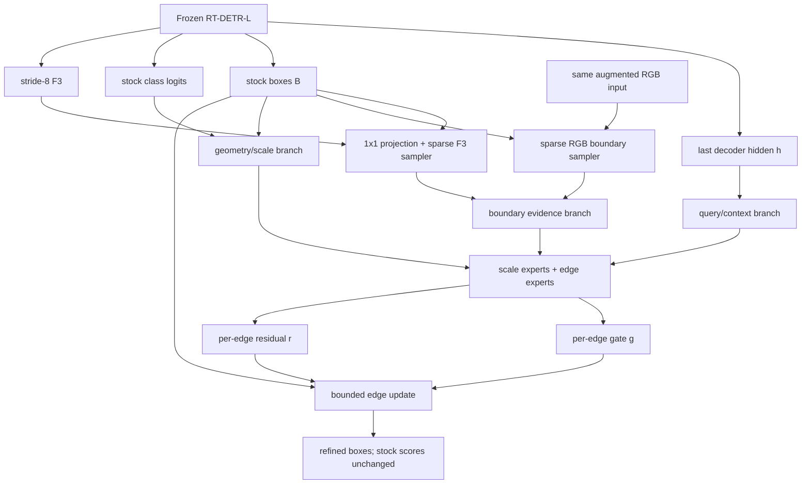

# IBER-BE Boundary Evidence 方法说明

> 方法名：**IBER-BE v1.0（Isolated Boundary-Evidence Refinement）**
>
> 中文名：**双分辨率隔离式边界证据细化器**
>
> 基础模型：Ultralytics RT-DETR-L 8.4.90
>
> 数据集：VisDrone2019-DET
>
> 状态：工程有效，Gate-1 `scientific_failed`，未进入 30 epoch detector screen
> 最佳 Gate-1 权威源码：`a61f6d189ed3ab3ab5f0c1bad606063db313b660`

## 1. 文档用途

本文档用于独立说明 IBER-BE 的研究动机、真实结构、边界采样、逐边细化、隔离损失、B0–B3 因果消融、预注册门禁和实验结果。

需要先明确：

> IBER-BE 不是已经提高检测 AP 的最终模型。它在冻结 detector 的匹配框 Probe 上得到过定位正信号，但没有通过机制归因门禁，因此没有进入真实 30 epoch AP 筛选。

## 2. 研究问题

RT-DETR-L 在 VisDrone 上的一类典型错误是：

```text
目标已经被 Query 找到
        ↓
预测框大致位置正确
        ↓
但四条边的位置不够精确
```

直接加 P2/P3 特征、注入 Query 或修改 decoder 会改变主检测链、候选竞争和匹配轨迹。IBER-BE 选择更窄的问题：

> 不改变 RT-DETR 的公共参数和候选结果，只在 stock box 四条边附近稀疏读取 F3 语义证据和 RGB 高分辨率证据，能否学会小幅、可控的逐边修正？

## 3. 设计原则

IBER-BE 冻结了以下边界：

- detector 始终 `eval()` 且 `requires_grad=False`；
- backbone、Hybrid Encoder、Query Selection、Decoder 和 stock head 不修改；
- Query 数保持 300，`max_det=300`，`NMS=False`；
- stock 分类分数不改；
- 不重做 Hungarian matching，仅复用 stock 最后一层 normal-query 匹配索引；
- 不建立 P2，不对 RGB 做全图高分辨率卷积；
- 不使用 trajectory、attention、新 Query、分类重打分或多次 detector forward；
- decoder hidden、stock box、stock score、F3 和 RGB 在进入私有模块前全部 detach。

这使 IBER-BE 成为一个与原 detector 隔离的私有定位插件，旨在先回答“边界证据是否真有用”，再决定是否值得进入昂贵的 detector screen。

## 4. 总体结构



私有模块的输入为：

```text
h_last:       [B, 300, 256]
box_stock:    [B, 300, 4]
score_logits: [B, 300, 10]
F3:           [B, C3, H3, W3]
image_rgb:    [B, 3, 640, 640]
```

`image_rgb` 是同一次 detector forward 使用的 letterbox/增强后 `[0,1]` RGB tensor，不重新读取图片，不改变样本顺序和增强序列。

## 5. 公共边界几何

stock box 从 `cxcywh` 转为 `xyxy = [left, top, right, bottom]`。对每条边，沿切向取三个固定位置：

```text
t ∈ {0.25, 0.50, 0.75}
```

对左/上/右/下四条边统一定义法向语义：

```text
outside  →  edge  →  inside
```

采样使用 bilinear `grid_sample`、`padding_mode="border"`、`align_corners=False`。极小框、贴边框和轻微越界框都必须保持有限且可复现。

三个切向位置采样后取均值，所以模块不依赖单个边界像素，而是建模每条边的平均 inside/outside 变化。

## 6. F3 语义边界证据

F3 路径先使用私有 `1×1 Conv` 将特征投影到 32 通道。法向距离为：

```text
d_f3 = clip(0.08 * min(w,h), 1/640, 4/640)
```

对每条边读取：

```text
outside = F3(edge - d_f3)
edge    = F3(edge)
inside  = F3(edge + d_f3)
```

形成有方向的边界证据：

```text
[edge, edge - outside, inside - edge]
```

32 通道×3 得到每条边 96 维证据，经过：

```text
Linear(96,32) -> SiLU
```

得到 F3 boundary embedding。F3 提供的主要是 stride-8 语义上下文，而不是精确像素边缘。

## 7. RGB 高分辨率边界证据

RGB 路径不建立新特征金字塔，只在 300 个 stock box 的四条边附近稀疏读取。使用两个与目标尺度相关的法向半径：

```text
d_near = clip(0.08 * min(w,h), 1/640, 4/640)
d_far  = clip(0.20 * min(w,h), 2/640, 8/640)
```

每条边形成：

```text
edge_rgb                         3
edge - near_outside             3
near_inside - edge              3
edge - far_outside              3
far_inside - edge               3
---------------------------------
total                           15
```

15 维 RGB 证据经过：

```text
Linear(15,16) -> LayerNorm(16) -> SiLU
```

这条路径的目标是提供 F3 中缺少的真实高分辨率局部对比，同时避免 P2/全图高分辨率卷积引入的背景噪声和计算开销。

## 8. Query、几何和尺度条件

除边界证据外，每个 Query 还使用：

- 最后一层 decoder hidden：`LayerNorm(256) -> Linear(256,64) -> SiLU`；
- box center；
- `log(w)`、`log(h)`、`log(area)` 和 `log(w/h)`；
- detached stock quality；
- detached class entropy；
- 左/上/右/下 4 个可学习 edge embedding。

最佳权威实现将目标软分为 tiny、small 和 other 三个尺度区间：

```text
tiny boundary  ≈ 16×16 pixels
small boundary ≈ 32×32 pixels
temperature    = 6
```

三个尺度权重经归一化后混合 3 个 scale expert，同时使用 4 个 edge-specific expert。因此左/上/右/下四条边不需共享完全相同的修正函数，tiny 和 larger object 也可以采用不同响应。

## 9. 差分边界隔离

如果直接把 boundary encoder 输出加到主路，边界分支的 bias 和容量本身也可以带来变化，从而无法判断收益是否来自真实证据。

最佳权威实现因此同时计算：

```text
direction_zero     = DirectionEncoder(zero_F3, zero_RGB, context)
direction_evidence = DirectionEncoder(real_F3, real_RGB, context)
```

对 gate 和 residual 都只保留有证据与零证据的差：

```text
boundary_gate_raw = Gate(direction_evidence) - Gate(direction_zero)
boundary_res_raw  = Res(direction_evidence)  - Res(direction_zero)
```

其中 boundary residual 再乘可学习增益，并严格限制在 `[0.5,4.0]`。

这个差分构造保证：

- B0 即使保留与 B3 相同的网络容量，零边界证据也不会制造伪边界残差；
- B3 相对 B0 的变化更接近“启用真实边界输入”的增量；
- `boundary_off` 可以在同一 checkpoint 下关闭边界增量，只保留几何/尺度基础细化。

## 10. 逐边 gate 和有界 residual

每个 Query 的四条边分别预测 gate 和 residual：

```text
gate_logits = base_gate_raw + boundary_gate_raw
g           = sigmoid(gate_logits)

res_raw = base_residual_raw + boundary_residual_raw
r       = tanh(res_raw)
```

对 stock edge `e=[l,t,r,b]` 的更新为：

```text
scale = [w,h,w,h]
e' = e + rho * scale * g * r
rho = 0.05
```

因为 `g∈[0,1]`、`r∈[-1,1]`，单次修正最大不超过当前框宽/高的 5%。边界更新后会重新限制为有效 `xyxy`，并保证 `right>left`、`bottom>top`。

所有 gate/residual 输出头的 weight 和 bias 均为零初始化，因此初始时：

```text
r = 0
refined box = stock box
```

这避免插件在训练刚开始时随机扰乱已成熟框。

## 11. 三种同 checkpoint 输出

IBER-BE 在同一个私有 checkpoint 下提供：

| 模式 | Box | Score | 用途 |
|---|---|---|---|
| `stock` | RT-DETR stock box | stock score | 原模型权威对照 |
| `boundary_off` | 仅基础几何/尺度细化 | stock score | 隔离 boundary 增量 |
| `refined` | 基础细化 + boundary 增量 | stock score | 完整方法 |

分类分数始终相同，所以同 checkpoint 比较只反映 box 位置变化。

## 12. 私有损失

### 12.1 最佳 `a61f6d18` Probe 使用的基础损失

```text
L_private = L_box + L_direction + 0.25 L_gate + 0.05 L_noop
L_box     = L1(refined, target) + GIoU(refined, target)
```

- `L_direction`：监督四条边应该向内或向外移动，并按真实修正幅度加权；
- `L_gate`：对 matched Query 使用修正幅度软标签，对 unmatched Query 学习关闭；
- matched 和 unmatched gate loss 分开归一化，避免 300 Query 中的大量 unmatched 项淹没正样本；
- `L_noop`：使用 detached stock quality 加权，惩罚 unmatched Query 的 `|g*r|`，防止无匹配候选被乱改。

损失只更新私有 refiner，detector 不接收梯度。

### 12.2 后续机制归因修订

由于初始 Probe 出现“matched IoU 过线，但 edge MAE 和 direction 不过线”，后续版本在不改门槛的前提下增加：

```text
+ 0.10 L_boundary_direction
+ 0.01 L_boundary_margin
```

- boundary-direction 对 tiny/small/other 使用全局有效边数量做逆频率平衡；
- boundary-margin 使用 `min(stock error, boundary_off error)` 作为反事实参照，要求 boundary 增量不只是跟随基础细化；
- 后续还测试了有符号边界融合、F3 可靠性门控和分阶段 F3 梯度。

这些修订均有独立源码提交和 Gate-1 结果，但没有一个版本通过完整 Gate-1。

## 13. B0–B3 因果消融

四个 Probe 使用相同参数量、相同私有初始化、相同 cache、相同样本顺序和相同 12 epoch 训练；唯一变量是进入 boundary encoder 的证据。

| Arm | F3 evidence | RGB evidence | 解释 |
|---|---:|---:|---|
| B0 | zero | zero | 同容量无边界证据对照 |
| B1 | on | zero | F3-only |
| B2 | zero | on | RGB-only |
| B3 | on | on | 双分辨率完整方法 |

特别注意：**B0 不等于 stock**。B0 仍然包含 Query/几何/尺度基础细化路径，只是边界输入置零。因此：

- `B0 - stock` 表示无边界基础细化收益；
- `B1 - B0` 表示 F3 边界输入增量；
- `B2 - B0` 表示 RGB 边界输入增量；
- `B3 - B1` 主要检验 RGB 在已有 F3 上的独立增量；
- `B3 - B2` 表示 F3 在已有 RGB 上的边际收益。

## 14. Gate-1 预注册条件

B3 必须同时满足：

1. edge MAE 相对 B0 下降至少 5%；
2. edge MAE 相对 B1 再下降至少 1.5%，证明 RGB 有独立增量；
3. refined matched IoU 相对 stock 提高至少 `0.005`；
4. tiny 和 small correction-direction accuracy 相对 B0 均提高至少 3 个百分点；
5. B3 同时取得最佳 edge MAE 和 matched IoU；
6. gate、residual、loss 和梯度有限、非零、未饱和；
7. 四臂参数量、初始化指纹、epoch 和 cache authority 一致。

任意一个核心条件失败，即冻结为 `scientific_failed`，不进入 30 epoch，不降低门槛。

## 15. 最佳 Gate-1 实验结果

权威源码：`a61f6d189ed3ab3ab5f0c1bad606063db313b660`

私有参数量：四臂均为 `230,931`
训练：冻结 detector、同 cache、同初始化、AdamW、12 epoch、AMP scale 128。

| Arm | Edge MAE | Stock matched IoU | Refined matched IoU | IoU delta | Small direction | Tiny direction |
|---|---:|---:|---:|---:|---:|---:|
| B0 | 0.004410 | 0.607851 | 0.611415 | +0.003564 | 0.604066 | 0.594866 |
| B1 | 0.004386 | 0.607851 | 0.613701 | +0.005850 | 0.607651 | 0.601791 |
| B2 | 0.004379 | 0.607851 | 0.615155 | +0.007304 | 0.610547 | **0.612826** |
| B3 | **0.004375** | 0.607851 | **0.615892** | **+0.008041** | **0.613587** | 0.610517 |

补充运行诊断：

| Arm | Gate mean | Gate P95 | Residual RMS | Gradient RMS | Total loss |
|---|---:|---:|---:|---:|---:|
| B0 | 0.288273 | 0.715424 | 0.380585 | 0.000744 | 1.045916 |
| B1 | 0.366782 | 0.820082 | 0.512113 | 0.000420 | 0.998087 |
| B2 | 0.364100 | 0.814762 | 0.472793 | 0.000516 | 0.998023 |
| B3 | 0.364090 | 0.842586 | 0.568990 | 0.000521 | 0.975568 |

工程审计全部通过：

- AMP authority；
- exact arm identity；
- equal cache authority；
- equal capacity；
- equal initialization；
- exact history；
- finite metrics；
- optimizer authority；
- frozen report authority。

Gate 结果：

| 条件 | 结果 |
|---|---|
| B3 取得最佳主指标 | `true` |
| matched IoU delta `>=0.005` | `true` |
| finite/non-zero activity | `true` |
| edge MAE 相对 B0 改善 `>=5%` | `false` |
| edge MAE 相对 B1 改善 `>=1.5%` | `false` |
| small direction 相对 B0 `>=+3 pp` | `false` |
| tiny direction 相对 B0 `>=+3 pp` | `false` |

最终决策：`scientific_failed`。

## 16. 为什么 `+0.008041` 仍然没有进入 30 epoch

### 16.1 它确实是一个弱正信号

B3 相对 stock 的 matched IoU 提高 `0.008041`，超过了 `0.005` 门槛；B3 也是四臂中最好的一臂。因此不能说 boundary input “完全没有信号”。

### 16.2 但边界定位机制的改善太弱

- B3 相对 B0 的 edge MAE 只改善约 `0.80%`，要求为 5%；
- B3 相对 B1 的 edge MAE 只改善约 `0.26%`，要求为 1.5%；
- small direction 相对 B0 只提高约 `0.952 pp`；
- tiny direction 相对 B0 只提高约 `1.565 pp`；
- 两者的门槛都是 `+3 pp`。

这意味着，虽然最终匹配框 IoU 变好，但模型并没有显示出足够强、足够可归因的“边界在哪里、应向哪里修”的能力。

### 16.3 RGB-only 已经获得绝大部分收益

```text
B3 - B2 = 0.615892 - 0.615155 = +0.000737
```

B2 已经非常接近 B3，说明完整 F3+RGB 联合结构没有表现出清晰的协同性，主要信号更像来自 RGB-only 路径。

### 16.4 Probe matched IoU 不是 detector mAP

Gate-1 只评估冻结 detector 中已被 Hungarian 匹配的正 Query。它不能回答：

- unmatched Query 是否会被错误修正；
- 重复框和假阳性是否增加；
- 原分类分数与新 box 质量是否对齐；
- Top-300 排序、Precision、Recall 和 AP 是否改善。

本项目的 LPR 实验已经证明：定位 loss 或 GIoU 改善可能不转化为 AP。因此预注册 Gate 要求在进入 30 epoch 之前先证明机制本身有足够强的信息量。

### 16.5 更准确的实验结论

不应写成：

> Boundary evidence 完全无效。

更准确的表述是：

> 启用双分辨率边界输入与 matched-IoU 弱正信号相关，但 edge MAE、tiny/small 修正方向和模态独立增量均未达到预注册门槛，因此不足以证明该机制会稳定提高真实检测 AP。

## 17. P2 boundary oracle 的后续证据

后续 P2 boundary-direction oracle 的结果为：

| Arm | Small direction | Tiny direction |
|---|---:|---:|
| Context + P2 | 0.554628 | 0.561330 |
| Context only | 0.594976 | 0.599354 |
| P2 only | 0.552306 | 0.548356 |
| 门槛 | 0.634066 | 0.624866 |

`context + P2` 低于 `context only`，决策为 `scientific_failed`。这进一步说明，当前浅层/边界输入对正确修正方向的独立信息量不足，不应通过降低 Gate 或重跑相同路线继续消耗训练预算。

## 18. Gate-2 原计划

只有 Gate-1 通过后，才允许 B3 从相同私有初始状态 fresh 启动：

```text
train: 647 张固定 10% 子集
val: 548 张完整验证集
seed: 0
epochs: 30
batch/workers/imgsz: 8/8/640
detector: frozen mature baseline
```

epoch30 原门禁包括：

- `delta mAP50-95 >= +0.0020`；
- `delta AP75 >= +0.0030`；
- `delta AP50 >= -0.0005`；
- AP-tiny 或 AP-small 至少一项为正；
- matched IoU 改善数量大于恶化数量；
- unmatched correction RMS 不超过 matched correction RMS 的 25%；
- gate/residual 未坍缩、未饱和；
- 三次独立评估逐值一致；
- 最后 5 epoch refined mAP 均值高于同 checkpoint stock 均值。

由于 Gate-1 失败，这个 Gate-2 未被启动，所以 IBER-BE 没有真实 30 epoch AP 结果。

## 19. 计算和部署属性

- 最佳四臂 Probe 的私有参数量均为 `230,931`；
- RGB 只做 stock box 边界附近稀疏 `grid_sample`，不做全图卷积；
- detector 只 forward 一次；
- 分类分数不改；
- 原设计目标为参数量/GFLOPs 增幅 `<1%`，端到端延迟增幅 `<3%`；
- 由于 Gate-1 科学失败，没有进入 Gate-2 的正式延迟/GFLOPs 冻结测量，不应宣称已经满足全部开销门槛。

## 20. 代码与证据位置

### 源代码分支

<https://github.com/kkc236/uav-detection-baselines/tree/codex/iber-be>

### 结果分支

<https://github.com/kkc236/uav-detection-baselines/tree/iber-be-v1-results>

### 核心文件

| 用途 | 文件 |
|---|---|
| 冻结设计 | `docs/superpowers/specs/2026-08-02-iber-be-v1-design.md` |
| 实施计划 | `docs/superpowers/plans/2026-08-02-iber-be-v1-implementation.md` |
| 边界采样 | `src/iber_sampling.py` |
| 细化 head | `src/iber_head.py` |
| 私有损失 | `src/iber_loss.py`；最佳早期版本使用 `src/itber_loss.py` |
| 冻结 detector adapter | `src/rtdetr_iber.py` |
| 协议与 authority | `src/iber_protocol.py` |
| Gate-1 Probe | `scripts/run_iber_probe.py` |
| 状态机 | `scripts/run_iber_pipeline.py` |
| 独立评估 | `scripts/evaluate_iber.py` |
| 开销评估 | `scripts/benchmark_iber.py` |
| 部署说明 | `docs/IBER_BE_SERVER_GUIDE.md` |

### 最佳 Gate-1 证据

```text
gate1-failures/a61f6d189ed3ab3ab5f0c1bad606063db313b660/
```

其中包含：

- `authority.json`；
- `stock-authority.json`；
- `pipeline-state.json`；
- `probe/b0-report.json` 至 `probe/b3-report.json`；
- `probe/gate1-decision.json`。

### P2 oracle 证据

```text
results/iber-p2-oracle-52a2cb78ce6b-seed10000/
```

## 21. 复现入口

必须先使用已冻结的 baseline、dataset hash、runtime amendment 和 publication config，再由状态机执行：

```bash
python scripts/run_iber_pipeline.py \
  --baseline-checkpoint /path/to/matched-baseline-best-epoch-0100.pt \
  --dataset-root /path/to/VisDrone \
  --run-root /path/to/immutable-run \
  --cache-root /path/to/immutable-cache \
  --publication-config /path/to/publication-screen.json \
  --device 0
```

具体参数必须以 `scripts/run_iber_pipeline.py --help`、已冻结 manifest 和 `docs/IBER_BE_SERVER_GUIDE.md` 为准。禁止手改 `pipeline-state.json`、绕过 Gate-1 或将 Probe checkpoint 续训为正式模型。

## 22. 最终结论

IBER-BE 的价值在于：

- 它将 RGB 高分辨率局部证据以稀疏采样方式引入，没有建立 P2 或修改主检测链；
- 它用同容量 B0–B3 和差分零证据对照尝试隔离真实 boundary 贡献；
- 它获得了 matched-IoU 弱正信号，最好的 B3 达到 `+0.008041`；
- 它也证明当前 boundary evidence 对 edge MAE 和 tiny/small correction direction 的独立改善不足；
- 因此该版本正确地冻结为科学失败，而不是用降门槛或只挑有利指标的方式宣称成功。

如果未来重新使用该路线，最值得保留的不是原始完整 B3，而是：

> **RGB-only B2 的稀疏双半径 inside/outside 对比、零证据差分隔离以及逐边有界 gate-residual 更新。**

任何重启都必须作为新设计版本另立门禁，不能改写 IBER-BE v1.0 已冻结的失败结论。
