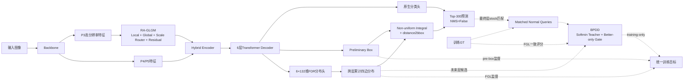

# Boundary, Trajectory, and Scale：面向无人机小目标检测的统一 RT-DETR-L 框架

> 中文工作标题：边界、轨迹与尺度：面向无人机小目标检测的统一 RT-DETR-L 框架
>
> English title: **Boundary, Trajectory, and Scale: A Unified RT-DETR-L Framework for UAV Small Object Detection**
>
> 文档状态：ICASSP 2027 中文详细底稿模板，不是最终投稿稿。
>
> 写作假设：FDR为已验证强基座，BPDD为已有正向证据的训练期贡献，RA-GLGM按最终成功且约带来 `+0.5 pp` mAP50-95 的情景组织。

## 模板使用说明

- `【实测·严格】`：可以追溯到冻结权重、协议和统一评估结果。
- `【实测·初步】`：确有实验结果，但严格paired Formal100尚未闭环。
- `【预估】`：用于提前组织成功版本论文，不是当前实验结论。
- `【待测】`：必须由最终实验填写。
- `<RESULT_TOKEN>`：正文中形如双花括号大写字段的机器可检索替换令牌；投稿前必须全部替换或删除。
- HTML注释 `<!-- EVIDENCE: ... -->` 用于写作审计，英文定稿前统一移除。

备选题目：

1. **Scale-Aware Fine-Grained Distribution Regression with Progressive Decoder Distillation for UAV Small Object Detection**
2. **Reliable Fine-Grained Localization via Target-Wise Decoder Distillation and Local–Global Scale Routing**

推荐保留当前题目，因为“Boundary—Trajectory—Scale”能够把三个组件组织为同一问题链，弱化模块堆叠感。

---

## 摘要

无人机俯视检测中的远距离目标通常只占少量像素，轻微边界偏移即可造成显著交并比下降；密集遮挡、背景纹理和尺度跨度又进一步增加了检测难度。RT-DETR-L虽然兼具端到端检测与实时性，但其连续框点估计难以显式表达模糊边界附近的细粒度位置分布，逐层Decoder监督未区分不同目标的中间轨迹质量，而统一的多尺度特征处理也难以同时兼顾局部细节与全局语义。为此，本文从边界表示、优化轨迹和尺度表征三个互补维度构建统一框架。首先，将D-FINE中的细粒度分布回归机制结构化适配至Ultralytics RT-DETR-L，通过preliminary box、六层累计四边分布与细粒度定位损失重构定位路径。其次，提出仅训练期启用的目标级渐进式Decoder分布蒸馏BPDD，从未来Decoder层构造GT一致的软教师，并以better-only门控抑制退化监督。最后，在P3高分辨率路径引入尺度路由局部—全局残差增强RA-GLGM，以有限扰动协调小目标细节与背景上下文。在VisDrone全数据、seed0、从零训练100轮的统一评估中，FDR将mAP50-95由0.21911提高到0.28966，即提升7.055个百分点；AP50和AP75分别提高9.805和7.951个百分点。【实测·严格】BPDD在严格配对Screen30中进一步提升0.189个百分点mAP，并在现有Formal100跨authority比较中取得0.260个百分点mAP和0.557个百分点AP75增益。【实测·初步】成功情景下，RA-GLGM预计在FDR+BPDD基础上进一步带来约0.5个百分点mAP50-95增益，完整模型达到 `{{FULL_MAP}}`。【预估，非实测】FDR参数量与GFLOPs分别增加1.00524%和0.18256%。【实测·严格】BPDD不改变推理图；RA-GLGM与完整模型的严格同机延迟仍待测量。【待测】结果预期表明，从尺度表征、边界分布和解码轨迹三个层面进行协同建模，有望增强实时DETR在无人机小目标场景中的定位可靠性。
<!-- EVIDENCE: FROZEN + PRELIMINARY + PLANNING_ESTIMATE -->

**关键词：** 无人机目标检测；小目标检测；RT-DETR；分布回归；知识蒸馏；尺度路由

---

## 1 引言

### 1.1 应用背景与现实困难

无人机被广泛用于城市道路巡检、交通流监测、园区安防和灾后搜救。与地面摄像头相比，无人机能够在短时间内覆盖更大区域，但其高空俯视视角使行人、非机动车和远处车辆在图像中只占少量像素。目标通常伴随密集排列、相互遮挡、运动模糊、复杂地面纹理及显著尺度变化。对一个宽度仅6像素的目标，水平方向偏移1像素就可能使IoU下降到约0.714，从而无法满足AP75所要求的严格定位条件。因此，无人机小目标检测不仅需要判断目标是否存在，还需要在有限视觉证据下给出精细且稳定的边界估计。

### 1.2 RT-DETR-L的三类局限

RT-DETR通过端到端集合预测避免NMS，并利用高效混合编码器和不确定性最小查询选择在精度与效率之间取得良好平衡。然而，将其直接用于无人机小目标仍存在三类互相关联的限制。第一，原生Decoder通过四个连续值直接回归边界框，难以显式描述模糊边界附近多个候选位置之间的竞争关系；对于极小目标，细微坐标误差会被IoU指标显著放大。第二，Transformer Decoder层间预测并不对每个目标、每条边单调改善，固定依赖最终层或无条件使用后层监督可能把退化轨迹传递给较早层。第三，P3等高分辨率特征同时包含小目标细节和大量背景纹理，单一局部或全局算子难以适应目标尺度变化，直接增强又可能破坏已经正确的表示。

### 1.3 统一解决思路

本文将上述困难组织为从特征到表示再到优化的因果链。RA-GLGM首先在P3路径依据尺度状态路由局部细节与全局上下文，并通过恒等残差限制新增分支对成熟特征的扰动；FDR随后将连续框点估计改写为preliminary box引导的四边分布累计细化，从表示层提高边界分辨率；BPDD则在训练阶段针对每个已匹配目标，从未来Decoder层构造质量更高的软教师，仅在教师确实优于当前层时蒸馏。三个组件分别作用于尺度表征、边界表示和优化轨迹，形成前后衔接的统一框架，而不是把多个注意力模块简单叠加到检测器上。

### 1.4 本文贡献

本文贡献概括如下：

1. **细粒度分布定位适配。** 在保持RT-DETR-L Backbone、Hybrid Encoder、Query选择、分类分支、匈牙利匹配和Top-300后处理不变的条件下，将D-FINE的FDR/FGL机制封装为YAML声明式定位单元，通过preliminary box、六层累计四边分布与非均匀Integral重构Decoder定位路径。本文贡献是面向Ultralytics RT-DETR-L与VisDrone的结构化适配、隔离集成和严格验证；FDR基础公式的来源仍是D-FINE。
2. **目标级渐进式Decoder蒸馏。** 提出参数为零、仅训练期启用的BPDD，从当前层之后的所有未来层构造GT一致的Softmin混合教师，并利用detached better-only权重避免退化教师造成负迁移。BPDD复用最终层stock匹配，不引入第二个matcher、匹配并集、unmatched Query或推理分支。
3. **尺度路由局部—全局增强。** 在P3高分辨率路径设计RA-GLGM，以局部分支保留小目标细节、全局分支提供背景判别上下文，并采用尺度条件门控和零初始化残差维持初始恒等映射。本文模板按其在FDR+BPDD上带来约0.5个百分点mAP增益的成功情景组织；该数字属于预估，最终稿必须替换为严格实测结果。
<!-- EVIDENCE: FROZEN + PRELIMINARY + PLANNING_ESTIMATE -->

---

## 2 相关工作

### 2.1 实时DETR检测器

DETR将目标检测建模为集合预测问题，并以匈牙利匹配建立一对一监督。Deformable DETR通过稀疏采样缓解收敛慢和高分辨率计算开销问题；RT-DETR进一步结合高效混合编码器和高质量Query选择，在保持端到端、NMS-free推理的同时达到实时检测速度。本文保留RT-DETR-L的Backbone、Encoder、Query和分类路径，仅在尺度表征、定位表示和训练期Decoder监督三个位置作隔离式修改。

### 2.2 无人机小目标与尺度表征

无人机小目标检测常通过高分辨率特征融合、额外浅层检测头、局部裁剪或尺度感知注意力增强细节。然而，高分辨率路径也会引入道路纹理、建筑边缘和重复背景，过强融合可能提高召回却降低精度。RA-GLGM不直接堆叠额外检测层，而是在P3路径内以局部—全局双分支和尺度路由控制增强强度，并通过恒等初始化降低训练早期破坏风险。

### 2.3 分布回归与Decoder蒸馏

D-FINE将DETR边界框回归重构为细粒度四边分布预测，并通过FGL、非均匀Integral和跨层细化改善定位。本文使用该机制作为强定位基础，并严格限制原创性声明。与固定最终层或全局覆盖式later-to-earlier蒸馏不同，BPDD针对每个匹配目标和边界，从所有未来层构造质量加权混合教师，并仅在该混合教师优于当前层时施加蒸馏。最终论文需加入D-FINE GO-LSD与固定最终层教师的同协议直接对照，以证明该风险控制设计的必要性。

---

## 3 方法

### 3.1 总体框架

给定输入图像 (I)，Backbone产生三层多尺度特征：

\[
\{X_3,X_4,X_5\}=\mathcal{B}(I).
\]

RA-GLGM仅作用于stride-8的P3特征：

\[
\widetilde X_3=\mathcal{R}_{\mathrm{RA}}(X_3),
\]

随后与P4、P5共同进入Hybrid Encoder和六层Transformer Decoder：

\[
E=\mathcal{E}(\widetilde X_3,X_4,X_5),\qquad
\{h_l,R_l\}_{l=0}^{L-1}=\mathcal{D}(E),
\]

其中 $h_l$ 和 $R_l$ 分别表示第 $l$ 层Decoder隐藏状态和参考框，且 $L=6$。FDR从这些状态生成preliminary box及六层累计四边分布，分类分支保持原生结构。训练阶段，BPDD读取各层分布、训练GT和最终层stock匹配，构造额外蒸馏损失；推理阶段完全移除BPDD。

#### 主方法图草图

正式论文图中，实线表示推理路径，虚线表示训练期路径。BPDD不得画入部署输出路径，RA-GLGM内部需展开Local、Global、Scale Router和Residual Fusion四个功能块。

### 3.2 FDR：细粒度分布定位

#### 3.2.1 Preliminary box

原生RT-DETR-L直接从各层hidden state回归四维框。本文首先从第0层状态生成共享粗定位参考：

\[
B_{\mathrm{pre}}
=\sigma\!\left(H_{\mathrm{pre}}(h_0)+\sigma^{-1}(R_0)\right).
\]

$B_{\mathrm{pre}}$ 将“目标大致位于何处”与“各边需要怎样细化”分离。其detached结果作为六层分布解码的共享几何参考，并接受额外L1/GIoU辅助监督。

#### 3.2.2 六层累计四边分布

设置 `reg_max=32`，每条边包含33个bin，四边共 $4\times33=132$ 个logits。第0层和后续层分布残差定义为：

\[
\Delta Z_0=H^{\mathrm{dist}}_0(h_0),
\]

\[
\Delta Z_l=H^{\mathrm{dist}}_l
\left(h_l+\operatorname{sg}(h_{l-1})\right),\quad l>0,
\]

\[
Z_l=Z_{l-1}+\Delta Z_l.
\]

这里 $\operatorname{sg}(\cdot)$ 表示stop-gradient。六个输出层零初始化，使训练开始时分布残差不偏向任一bin。

#### 3.2.3 Non-uniform Integral与FGL

对边 (e)，将累计logits转为概率并通过固定非均匀投影 (W(k)) 得到连续距离：

\[
P^e_{l,k}=\operatorname{softmax}(Z_l^e)_k,
\qquad
d_l^e=\sum_{k=0}^{32}P^e_{l,k}W(k),
\]

\[
\hat B_l=\operatorname{distance2bbox}
\left(d_l,\operatorname{sg}(B_{\mathrm{pre}})\right).
\]

若GT边界位置 (y) 落在相邻分箱 (m) 与 (m+1) 之间，其插值系数为 (eta)，FGL proper score为：

\[
S(P,y)=-(1-\eta)\log P_m-\eta\log P_{m+1}.
\]

FGL使用detached matched IoU (q) 加权：

\[
\mathcal{L}_{\mathrm{FGL}}
=\frac{1}{N}\sum q^{\operatorname{sg}}S(P,y).
\]

该损失复用stock Hungarian assignment产生的一对一匹配索引，不调用第二个matcher。FDR、FGL、Integral和非均匀weighting的基础机制来自D-FINE；本文只主张其在Ultralytics RT-DETR-L上的结构化迁移、YAML封装和统一验证。

### 3.3 BPDD：目标级渐进式Decoder分布蒸馏

#### 3.3.1 动机

FDR提高了边界分布的表达粒度，但Decoder预测并不保证对每个目标和每条边逐层改善。固定将最终层作为教师可能在个别轨迹上产生负迁移。BPDD对每个最终层stock匹配到的normal Query独立判断：未来层中是否存在比当前层更可靠的边界分布，以及这种优势是否足够大到值得蒸馏。

#### 3.3.2 Future-only混合教师

对当前层 (l)，以所有未来层 (k>l) 为候选，并使用与FGL一致的GT proper score构造Softmin权重：

\[
\alpha_{lk}
=\frac{\exp[-S(P_k,y)/\tau]}
{\sum_{j>l}\exp[-S(P_j,y)/\tau]},
\]

\[
T_l=\sum_{k>l}\alpha_{lk}P_k.
\]

教师质量必须通过实际混合分布 $S(T_l,y)$ 评价，而不能用候选误差的加权平均代替，因为后者无法反映混合后概率质量。

#### 3.3.3 Better-only可靠性门控

定义当前分布与混合教师的相对优势：

\[
r_l=\operatorname{sg}\!\left[
\max\left(
0,
\frac{S(P_l,y)-S(T_l,y)-\delta}
{S(P_l,y)+\epsilon}
\right)
\right].
\]

只有当混合教师优于当前层并超过安全边际 $\delta$ 时，$r_l$ 才大于零。教师、Softmin权重和门控全部detach，避免辅助路径反向改变教师选择规则。

#### 3.3.4 BPDD损失与隔离边界

\[
\mathcal{L}_{\mathrm{BPDD}}
=\frac{1}{|\Omega|}
\sum_{(q,e,l)\in\Omega}
r_l D_{\mathrm{KL}}
\left(\operatorname{sg}(T_l)\Vert P_l\right),
\]

其中 $\Omega$ 只包含最终stock匹配得到的normal Queries、四条边和非最终Decoder层。BPDD不蒸馏DN Query、不匹配unmatched Query、不建立匹配并集、不改变分类得分，也不加入推理分支。因此，其训练后checkpoint由普通FDR推理图加载，推理参数和GFLOPs理论上与FDR相同。

### 3.4 RA-GLGM：尺度路由局部—全局增强

> 本节按成功情景撰写。最终算子、路由目标和数值必须与冻结成功版本一致。

#### 3.4.1 局部与全局专家

RA-GLGM作用于P3特征 $X\in\mathbb{R}^{B\times C\times H\times W}$。局部分支 $\Phi_{\ell}(X)$ 聚合邻域边缘与纹理，用于保留极小目标的局部结构；全局分支 $\Phi_g(X)$ 扩展感受野，用于区分目标与道路、建筑边缘等重复背景。两分支保持相同输出维度，以便进行逐位置或逐组路由。

#### 3.4.2 尺度路由

尺度路由器根据特征摘要预测局部与全局专家权重：

\[
[\pi_{\ell},\pi_g]
=\operatorname{softmax}(\rho_s(X)),
\]

\[
\Phi_{\mathrm{lg}}(X)
=\pi_{\ell}\odot\Phi_{\ell}(X)
+\pi_g\odot\Phi_g(X).
\]

若最终实现使用GT尺寸对路由进行训练期校准，论文必须明确GT只参与训练监督，推理阶段的 $(\pi_{\ell},\pi_g)$ 完全由图像特征预测。最终成功版本还应报告路由分布、熵和各尺度召回，证明门控没有坍缩到单一专家。

#### 3.4.3 恒等残差

为降低额外特征对成熟FDR路径的破坏，采用有界尺度门 $g_s$ 与零初始化残差系数 $\alpha$：

\[
Y=X+\alpha\,g_s(X,\hat s)\odot\Phi_{\mathrm{lg}}(X),
\qquad g_s\in[0,1],\quad \alpha(0)=0.
\]

初始时 $Y=X$，模型从FDR兼容状态开始学习；随着训练进行，网络仅在有证据的空间位置和尺度状态下逐步引入局部—全局增强。本文预估该模块在FDR+BPDD基础上进一步带来约 `{{RA_DELTA_MAP}} ≈ +0.5 pp` mAP50-95增益。【预估，非实测】
<!-- EVIDENCE: PLANNING_ESTIMATE -->

### 3.5 统一训练目标与推理路径

完整训练目标为：

\[
\mathcal{L}=
\mathcal{L}_{\mathrm{RT\text{-}DETR}}
+\lambda_{\mathrm{fgl}}\mathcal{L}_{\mathrm{FGL}}
+\lambda_{\mathrm{pre}}\mathcal{L}_{\mathrm{pre}}
+\lambda_{\mathrm{bpdd}}\mathcal{L}_{\mathrm{BPDD}}
+{{\lambda_{ra}\mathcal{L}_{ra}}}.
\]

其中 $\mathcal{L}_{\mathrm{RT\text{-}DETR}}$ 保留stock VFL、L1、GIoU、Encoder/Decoder auxiliary losses和DN losses；$\mathcal{L}_{\mathrm{pre}}$ 为preliminary box的L1/GIoU监督。只有当冻结RA-GLGM实现确实包含独立尺度辅助目标时，才保留最后一项；否则删除 `{{\lambda_{ra}\mathcal{L}_{ra}}}`。

推理时只保留Backbone、RA-GLGM、Hybrid Encoder、Transformer Decoder、分类头和FDR定位头。BPDD及所有GT相关计算全部移除，Query数、Top-300、NMS=False和类别映射保持不变。

---

## 4 实验

### 4.1 数据集与统一协议

实验使用同一份VisDrone train/val：训练图像6471张，验证图像548张，共10类。数据集SHA256为 `FD92E9FF4B3B58FCDD5A32F7E770FC3398E566B627DB0E188CB5FF9F3B7BBDAB`。固定10%筛选子集包含647张图像，SHA256为 `52660F55552FFD953E2EE26F55FD0A1CB14217DBBEA0F5F3B981C3514F8D93A0`。

统一环境与训练设置如下：

| 项目 | 配置 |
|---|---|
| 基础模型 | Ultralytics RT-DETR-L |
| Ultralytics | 8.4.90 |
| GPU | NVIDIA GeForce RTX 4090，24GB |
| Driver / CUDA | 550.142 / 12.1 |
| Python | 3.10.12 |
| PyTorch / Torchvision | 2.5.1+cu121 / 0.20.1+cu121 |
| 初始化 | pretrained=False，从零训练 |
| 正式训练 | 100 epochs，seed0，deterministic=True |
| 输入 / batch / workers | 640 / 8 / 8 |
| AMP | True，固定scale 128 |
| Optimizer | MuSGD |
| lr0 / lrf | 0.01 / 0.01 |
| momentum / weight decay | 0.937 / 0.0005 |
| warmup | 3.0 epochs，momentum 0.8，bias lr 0.0 |
| Query / max_det | 300 / 300 |
| 后处理 | NMS=False |
| cache | False |

数据增强统一为：mosaic 1.0、close_mosaic 10、mixup 0.0、scale 0.5、translate 0.1、degrees/shear/perspective 0、flipud 0、fliplr 0.5、hsv_h/s/v为0.015/0.7/0.4、cutmix/copy_paste为0。所有配对实验必须共享公共参数初始化、样本顺序、增强随机序列、验证预处理、类别映射及checkpoint/resume规则。旧控制文档中的 `optimizer=auto` 或 `warmup_bias_lr=0.1` 不属于本论文正式authority。

F1暂不进入主表，因为历史evaluator的F1与按聚合Precision/Recall计算的谐均值存在口径冲突；只有统一重导出后才恢复该列。

### 4.2 主结果

表1中的Control和FDR为严格同authority seed0 Formal100结果；BPDD行是当前单臂Formal100相对既有FDR100的初步跨authority比较，最终投稿稿必须由 `{{BPDD_STRICT_*}}` 替换。RA-GLGM和Full Model均为待测成功情景。

**表1  VisDrone总体检测结果**

| 方法 | 证据状态 | Precision | Recall | AP50 | AP75 | mAP50-95 | ΔmAP |
|---|---|---:|---:|---:|---:|---:|---:|
| RT-DETR-L | 实测·严格 | 0.46761 | 0.41731 | 0.38663 | 0.21302 | 0.21911 | — |
| RT-DETR-L + FDR | 实测·严格 | **0.56911** | **0.49278** | **0.48468** | **0.29253** | **0.28966** | +7.055 pp |
| FDR + BPDD† | 实测·初步 | 0.570634 | 0.494464 | 0.486407 | 0.298096 | 0.292258 | +0.260 pp |
| FDR + RA-GLGM | 待测 | {{RA_PRECISION}} | {{RA_RECALL}} | {{RA_AP50}} | {{RA_AP75}} | {{RA_MAP}} | {{RA_DELTA_MAP}} |
| Full Model | 待测 | {{FULL_PRECISION}} | {{FULL_RECALL}} | {{FULL_AP50}} | {{FULL_AP75}} | {{FULL_MAP}} | {{FULL_DELTA_MAP}} |

† BPDD当前Formal100数字不是fresh paired Formal100，最终主表使用 `{{BPDD_STRICT_PRECISION}}`、`{{BPDD_STRICT_RECALL}}`、`{{BPDD_STRICT_AP50}}`、`{{BPDD_STRICT_AP75}}` 和 `{{BPDD_STRICT_MAP}}` 替换。

FDR相对原版RT-DETR-L在全部总体指标上取得大幅提升，说明细粒度分布定位不仅改善AP75，也提高了AP50、Precision和Recall，不是简单的精召交换。【实测·严格】BPDD进一步提高AP75的幅度大于mAP，初步支持其主要改善严格定位质量的设计动机，但严格效应量仍需fresh配对确认。【实测·初步】按成功情景，RA-GLGM在FDR+BPDD上增加约0.5个百分点mAP，并使Full Model严格优于最强双模块配置 `{{FULL_DELTA_OVER_BEST_PAIR}}`。【预估，非实测】
<!-- EVIDENCE: FROZEN + PRELIMINARY + PLANNING_ESTIMATE -->

### 4.3 模块级消融

**表2  三组件模块级消融**

| FDR | BPDD | RA-GLGM | AP50 | AP75 | mAP50-95 | Params (#) | GFLOPs@640 | Median latency (ms) | 状态 |
|:---:|:---:|:---:|---:|---:|---:|---:|---:|---:|---|
| × | × | × | 0.38663 | 0.21302 | 0.21911 | 32,826,626 | 108.0319 | {{CONTROL_LAT_MED_MS}} | 实测·严格/延迟待测 |
| ✓ | × | × | 0.48468 | 0.29253 | 0.28966 | 33,156,614 | 108.2291 | {{FDR_LAT_MED_MS}} | 实测·严格/延迟待测 |
| ✓ | ✓ | × | {{BPDD_STRICT_AP50}} | {{BPDD_STRICT_AP75}} | {{BPDD_STRICT_MAP}} | 33,156,614 | 108.2291 | {{BPDD_LAT_MED_MS}} | 待严格配对 |
| ✓ | × | ✓ | {{RA_AP50}} | {{RA_AP75}} | {{RA_MAP}} | {{RA_PARAMS}} | {{RA_GFLOPS}} | {{RA_LAT_MED_MS}} | 待测 |
| ✓ | ✓ | ✓ | {{FULL_AP50}} | {{FULL_AP75}} | {{FULL_MAP}} | {{FULL_PARAMS}} | {{FULL_GFLOPS}} | {{FULL_LAT_MED_MS}} | 待测 |

该表用于检验模块增量与组合协同；只有完整结果严格高于两个双模块组合时，才能据此支持协同结论。它不能替代各模块内部消融。FDR需补no-FGL、no-prebox-loss、no-cumulative和no-prebox；BPDD需补official GO-LSD、fixed-final、no-gate和hard-gate；RA-GLGM需补等参数Conv、uniform router、local-only、global-only以及无恒等初始化控制。

### 4.4 分尺度结果

本文尺度定义为：Tiny `<256 px²`，Small `[256,1024) px²`，Medium `[1024,9216) px²`，Large `≥9216 px²`。表中APsize均表示对应尺度的mAP50-95。

**表3  分尺度mAP50-95**

| 方法 | APtiny | APsmall | APmedium | APlarge | 证据状态 |
|---|---:|---:|---:|---:|---|
| RT-DETR-L | 0.08684 | 0.21784 | 0.32499 | 0.31822 | 实测·严格 |
| +FDR | 0.14480 | 0.28998 | 0.39630 | 0.38608 | 实测·严格 |
| +FDR+BPDD† | 0.14464 | 0.29776 | 0.39666 | 0.37685 | 实测·初步 |
| +FDR+RA-GLGM | {{RA_AP_TINY}} | {{RA_AP_SMALL}} | {{RA_AP_MEDIUM}} | {{RA_AP_LARGE}} | 待测 |
| Full Model | {{FULL_AP_TINY}} | {{FULL_AP_SMALL}} | {{FULL_AP_MEDIUM}} | {{FULL_AP_LARGE}} | 待测 |

FDR在当前seed0四尺度均正向，其中Tiny提高5.795个百分点。【实测·严格】BPDD初步结果中Small提高0.778个百分点，四尺度AP75均正向；但Tiny mAP近乎持平，Large mAP下降0.923个百分点且Large仅130个GT，因此不能写成四尺度全面提升。【实测·初步】RA-GLGM成功版本应重点验证APtiny和APsmall，并要求APmedium/APlarge不出现不可接受退化。【待测】
<!-- EVIDENCE: FROZEN + PRELIMINARY + PENDING -->

### 4.5 十类别结果

**表4  VisDrone十类别mAP50-95**

| 类别 | Control | FDR | BPDD† | RA-GLGM | Full Model |
|---|---:|---:|---:|---:|---:|
| pedestrian | 0.17638 | 0.27277 | 0.27318 | {{RA_MAP_PEDESTRIAN}} | {{FULL_MAP_PEDESTRIAN}} |
| people | 0.13004 | 0.20888 | 0.21168 | {{RA_MAP_PEOPLE}} | {{FULL_MAP_PEOPLE}} |
| bicycle | 0.05132 | 0.11044 | 0.10527 | {{RA_MAP_BICYCLE}} | {{FULL_MAP_BICYCLE}} |
| car | 0.54785 | 0.60930 | 0.61307 | {{RA_MAP_CAR}} | {{FULL_MAP_CAR}} |
| van | 0.31458 | 0.37972 | 0.37323 | {{RA_MAP_VAN}} | {{FULL_MAP_VAN}} |
| truck | 0.21277 | 0.26403 | 0.27424 | {{RA_MAP_TRUCK}} | {{FULL_MAP_TRUCK}} |
| tricycle | 0.12815 | 0.20574 | 0.20867 | {{RA_MAP_TRICYCLE}} | {{FULL_MAP_TRICYCLE}} |
| awning-tricycle | 0.08782 | 0.11370 | 0.12052 | {{RA_MAP_AWNING_TRICYCLE}} | {{FULL_MAP_AWNING_TRICYCLE}} |
| bus | 0.34460 | 0.43801 | 0.44789 | {{RA_MAP_BUS}} | {{FULL_MAP_BUS}} |
| motor | 0.19754 | 0.29401 | 0.29484 | {{RA_MAP_MOTOR}} | {{FULL_MAP_MOTOR}} |

FDR在当前seed0十类别全部正向。【实测·严格】BPDD初步比较中8/10类别mAP正向，bicycle和van下降；AP75为9/10类别正向，van下降。因此BPDD不得描述为十类别全面提升。【实测·初步】正式四页稿可以只保留类别胜负数和关键类别，完整十类表移至补充材料。
<!-- EVIDENCE: FROZEN + PRELIMINARY -->

### 4.6 参数、GFLOPs与延迟

**表5  部署效率**

| 方法 | Params (#) | ΔParams (%) | GFLOPs@640 | ΔGFLOPs (%) | Median/P90 latency (ms) | FPS | Peak VRAM (MiB) | 状态 |
|---|---:|---:|---:|---:|---:|---:|---:|---|
| RT-DETR-L | 32,826,626 | — | 108.0318976 | — | {{CONTROL_LAT_MED_MS}} / {{CONTROL_LAT_P90_MS}} | {{CONTROL_FPS}} | {{CONTROL_VRAM_MB}} | 待统一benchmark |
| +FDR | 33,156,614 | +1.00524% | 108.2291200 | +0.18256% | {{FDR_LAT_MED_MS}} / {{FDR_LAT_P90_MS}} | {{FDR_FPS}} | {{FDR_VRAM_MB}} | 静态量严格，延迟待测 |
| +FDR+BPDD | 33,156,614 | +0% vs FDR | 108.2291200 | +0% vs FDR | {{BPDD_LAT_MED_MS}} / {{BPDD_LAT_P90_MS}} | {{BPDD_FPS}} | {{BPDD_VRAM_MB}} | 同推理图，待同机封口 |
| +FDR+RA-GLGM | {{RA_PARAMS}} | {{RA_DELTA_PARAMS}} | {{RA_GFLOPS}} | {{RA_DELTA_GFLOPS}} | {{RA_LAT_MED_MS}} / {{RA_LAT_P90_MS}} | {{RA_FPS}} | {{RA_VRAM_MB}} | 待测 |
| Full Model | {{FULL_PARAMS}} | {{FULL_DELTA_PARAMS}} | {{FULL_GFLOPS}} | {{FULL_DELTA_GFLOPS}} | {{FULL_LAT_MED_MS}} / {{FULL_LAT_P90_MS}} | {{FULL_FPS}} | {{FULL_VRAM_MB}} | 待测 |

FDR参数增量为1.00524%，不能写成“小于1%”。BPDD理论上不改变推理图，但“零额外推理延迟”必须由同一GPU、相同warmup、相同runs和相同输入完成严格实测后才能写入摘要。

### 4.7 定性案例设计

定性图不得人工只挑最好样本，使用以下固定规则：

1. **极小行人案例：** Tiny pedestrian/people，按 `IoU_Full-IoU_Control` 排序，选前两例并保留一例最大退化。
2. **密集车辆案例：** 同一图像含至少 `{{DENSE_COUNT_THRESHOLD}}` 个car/van/truck目标，比较漏检、重复框和边界贴合度。
3. **AP75跨越案例：** FDR IoU位于 `[0.65,0.75)` 且BPDD或Full达到 `≥0.75`，展示严格定位改善。
4. **尺度路由案例：** 分别选择Tiny、Small和Medium目标，展示RA-GLGM局部/全局路由热图与最终框。
5. **失败案例：** 至少展示一个背景纹理误检、一个严重遮挡漏检或一个Large目标退化案例。

每个案例统一展示GT、RT-DETR-L、FDR、FDR+BPDD和Full Model，并公开image id、类别、尺度、置信度和匹配IoU。GT只用于训练监督和离线选例，不得描述成推理输入。

### 4.8 与相关方法的必要对照

最终主表至少包括：原版RT-DETR-L、完整D-FINE或可复现实验结果、D-FINE GO-LSD、典型UAV小目标DETR方法，以及本文各组合。GO-LSD是BPDD最接近的已知方法：二者都利用跨层定位分布蒸馏并保持无额外推理分支；区别在于BPDD使用future-only多层混合教师、FGL一致评分、实际混合质量评估和better-only门控。没有同协议GO-LSD与fixed-final+same-gate对照时，不得声称BPDD优于既有蒸馏机制。

### 4.9 统计与验证集选择控制

最终结构和超参数应在train-derived dev上冻结，官方VisDrone val只进行一次确认性评估。除seed0外，至少补一个额外seed或对逐图paired prediction进行bootstrap，报告mAP/AP75差值的置信区间；理想情况下再补第二个无人机数据集。定性案例选择规则、checkpoint规则和主指标必须预先冻结，不能在看到结果后改用best epoch、特定类别或单轮曲线。

### 4.10 结果讨论模板

FDR带来的大幅提升说明连续四维点估计确实限制了当前RT-DETR-L在VisDrone上的定位表现；其AP50、AP75和四尺度同时提高，支持分布表示作为强定位基座。【实测·严格】BPDD的进一步增益较小，但AP75提升相对突出，与“选择更可靠的Decoder边界轨迹”动机一致；由于Formal100尚非fresh严格配对，该结论当前只能作为初步证据。【实测·初步】RA-GLGM若达到约0.5个百分点增益并通过等参数控制，将说明P3尺度条件特征仍能向成熟FDR提供互补信息；若Full未超过最强双模块，则不能宣称三模块协同。【预估/待测】
<!-- EVIDENCE: FROZEN + PRELIMINARY + PLANNING_ESTIMATE + PENDING -->

---

## 5 结论

本文面向无人机小目标检测中的尺度变化、边界模糊和Decoder轨迹不可靠问题，构建了统一的RT-DETR-L增强框架。FDR以preliminary box和六层累计四边分布提高边界表达粒度；BPDD通过future-only混合教师和better-only门控选择性蒸馏可靠轨迹；RA-GLGM在P3路径以尺度路由协调局部细节与全局上下文。现有严格实验已经证明FDR相对原版RT-DETR-L取得7.055个百分点mAP50-95提升，BPDD也表现出进一步改善AP75的潜力。RA-GLGM及完整模型的最终结论将在统一100轮、组合消融和效率审计完成后由 `{{RA_MAP}}` 与 `{{FULL_MAP}}` 替换。若三个组件均通过冻结门槛，该框架将提供一种兼顾细粒度定位、训练可靠性和尺度适应性的无人机实时检测方案。
<!-- EVIDENCE: FROZEN + PRELIMINARY + PLANNING_ESTIMATE -->

---

## ICASSP四页压缩方案

| 内容 | 建议版面 | 保留内容 |
|---|---:|---|
| Abstract | 约0.18页 | 问题、三组件、最终主结果、开销 |
| Introduction + Related Work | 约0.62页 | 三个痛点、统一思路、三条贡献；相关工作压成一段 |
| Method | 约1.55页 | 主方法图、FDR简述、BPDD主体、RA-GLGM约0.22页 |
| Experiments | 约1.43页 | 一张主表、一张消融与效率合并表、GO-LSD行、尺度一句话摘要 |
| Conclusion | 约0.12页 | 只保留实测结论 |

正文不同时放置完整尺度表、十类别表和定性图；这些内容默认进入公开补充材料。若版面仍不足，优先压缩FDR背景与RA机制描述，但不能删除严格配对、GO-LSD、等参数RA控制和效率证据。

---

## 投稿前令牌清单

以下令牌必须全部替换或删除：

- BPDD严格配对：`{{BPDD_STRICT_PRECISION}}`、`{{BPDD_STRICT_RECALL}}`、`{{BPDD_STRICT_AP50}}`、`{{BPDD_STRICT_AP75}}`、`{{BPDD_STRICT_MAP}}`。
- RA总体：`{{RA_PRECISION}}`、`{{RA_RECALL}}`、`{{RA_AP50}}`、`{{RA_AP75}}`、`{{RA_MAP}}`、`{{RA_DELTA_MAP}}`。
- Full总体：`{{FULL_PRECISION}}`、`{{FULL_RECALL}}`、`{{FULL_AP50}}`、`{{FULL_AP75}}`、`{{FULL_MAP}}`、`{{FULL_DELTA_MAP}}`、`{{FULL_DELTA_OVER_BEST_PAIR}}`。
- 分尺度与类别：全部 `{{RA_AP_*}}`、`{{FULL_AP_*}}`、`{{RA_MAP_*}}`、`{{FULL_MAP_*}}`。
- 效率：全部 `{{*_PARAMS}}`、`{{*_GFLOPS}}`、`{{*_LAT_MED_MS}}`、`{{*_LAT_P90_MS}}`、`{{*_FPS}}`、`{{*_VRAM_MB}}`。
- 结构参数：`{{\lambda_{ra}\mathcal{L}_{ra}}}` 和 `{{DENSE_COUNT_THRESHOLD}}`。

---

## 参考文献占位

1. N. Carion et al., “End-to-End Object Detection with Transformers,” ECCV, 2020.
2. X. Zhu et al., “Deformable DETR: Deformable Transformers for End-to-End Object Detection,” ICLR, 2021.
3. W. Lv et al., “DETRs Beat YOLOs on Real-time Object Detection,” CVPR, 2024.
4. Y. Peng et al., “D-FINE: Redefine Regression Task in DETRs as Fine-grained Distribution Refinement,” ICLR, 2025.
5. VisDrone dataset reference：最终使用官方BibTeX补齐作者、题目、会议和页码。
6. ICASSP/UAV small-object related work：最终从正式检索库导入，不手工虚构题录。

---

## 最终写作边界

可以写：

> 本文以FDR为统一强定位基础，提出目标级风险受控的渐进式Decoder分布蒸馏，并设计尺度路由局部—全局增强，从边界、轨迹和尺度三个维度改善无人机小目标检测。

不能写：

- 本文首次提出FDR、FGL、Integral或跨层定位蒸馏；
- BPDD已完成严格paired Formal100或已经优于GO-LSD；
- RA-GLGM现有v1.1已经正式成功；
- 三模块已证明协同，除非Full严格优于两个双模块组合；
- 参数增幅小于1%、延迟增幅小于3%或BPDD零延迟，除非同机benchmark完成；
- 单seed结果证明普适有效或统计显著。
