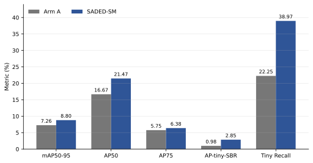
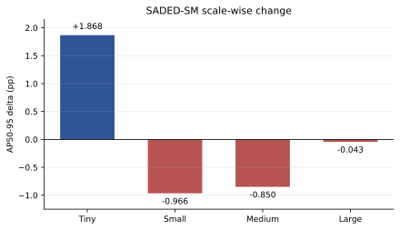
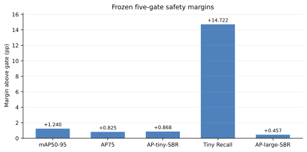

# SADED-SM Fresh100 实验进程报告

日期：2026-07-26
状态：创新点1单种子主实验完成，`SADED_SINGLE_SEED_GO`

## 1. 报告目的

本报告把当前封存结果整理为论文实验章节可直接使用的结构，回答三个问题：

1. 目前完成了哪些实验，证据闭包是否可靠；
2. 哪些指标适合放入论文主表和可视化图；
3. 当前结果能够支持什么论点，尚缺哪些论文实验。

## 2. 指标选择依据

RT-DETR 原论文采用标准 COCO 检测指标，包括 AP（IoU 0.50:0.95）、
AP50、AP75 和分尺度 AP，同时报告参数量、延迟与 FPS；其消融表也把
准确率和延迟放在一起比较。[RT-DETR paper](https://arxiv.org/abs/2304.08069)

VisDrone 目标检测论文通常至少报告 AP、AP50、AP75 和分尺度 AP。
切片式航空目标检测工作还会同时报告单图耗时；VisDrone 专项论文也
常补充 AR@K 和分类别 AP。
[Clustered Object Detection in Aerial Images](https://openaccess.thecvf.com/content_ICCV_2019/papers/Yang_Clustered_Object_Detection_in_Aerial_Images_ICCV_2019_paper.pdf),
[VistrongerDet](https://openaccess.thecvf.com/content/ICCV2021W/VisDrone/papers/Wan_VistrongerDet_Stronger_Visual_Information_for_Object_Detection_in_VisDrone_Images_ICCVW_2021_paper.pdf)

因此，本研究当前论文主表保留：

- mAP50-95、AP50、AP75；
- AP-tiny-SBR、AP-small-SBR、AP-medium-SBR、AP-large-SBR；
- 针对研究问题补充 Tiny Recall；
- 效率指标单独列为待补实验，不用 TP/FP 明细挤占正文主表。

SBR 分尺度是本研究的自定义有效尺度口径：有效 GT 等效边长
`sqrt(effective width * effective height)`，tiny `<=16`、small
`(16,32]`、medium `(32,96]`、large `>96` 像素。它不是 COCO 官方
尺度分箱，论文中必须明确说明。

## 3. 研究问题

| 编号 | 研究问题 | 当前判据 | 状态 |
|---|---|---|:---:|
| RQ1 | 固定多视图路由能否提高 tiny 检测能力？ | AP-tiny-SBR、Tiny Recall | 已回答 |
| RQ2 | tiny 增益能否转化为统一预测集的总体收益？ | mAP50-95、AP50、AP75 | 已回答 |
| RQ3 | 增加局部视图时能否基本保持 large 能力？ | AP-large-SBR 下降不超过0.5pp | 已回答 |
| RQ4 | small/medium 负向变化来自何处？ | 路由边界、Top-300、组件消融 | 待消融 |
| RQ5 | 五视图方案的计算代价是否可接受？ | Latency、FPS、VRAM、GFLOPs | 待测试 |
| RQ6 | 结果是否具备跨种子和测试集稳定性？ | seed1/2、一次锁定测试确认 | 延后 |

## 4. 解决方案简述

SADED-SM 使用一个固定的100 epoch RT-DETR-L checkpoint：

1. 对完整图像执行一次检测，得到 Arm A；
2. 对四个固定局部视图执行检测；
3. 用不依赖 GT 的预测尺度路由保护全图 non-tiny 候选；
4. 局部视图主要补充 tiny 候选；
5. 通过固定匹配、碎片抑制和 Top-300 容量规则输出单一预测集；
6. Arm A 与 SADED-SM 使用同一个 checkpoint，差异只来自五视图路由。

该方法的关键目标不是让每个尺度同时上升，而是让局部视图带来的
tiny 增益不再明显破坏全图 large 定位。

## 5. 实验协议

| 项目 | 固定设置 |
|---|---|
| 基础模型 | Ultralytics RT-DETR-L |
| 初始化 | `pretrained=False`，从零训练 |
| 数据集 | VisDrone train/val |
| 训练/验证图像 | 6,471 / 548 |
| 类别数 | 10 |
| Epoch | 100 |
| Seed | 0 |
| 输入尺寸 | 640 |
| Batch / Workers | 8 / 8 |
| Optimizer | MuSGD |
| AMP | True，固定 scale 128 |
| Queries / maxDet | 300 / 300 |
| NMS | False |
| 正式评估 checkpoint | `last.pt` |
| Checkpoint SHA256 | `515674348D0FF542663FE6FB4317240FC167A71EA31FACC1DEFE6A7E91B521F8` |
| 评估范围 | 固定 VisDrone val；未读取 test-dev |

## 6. 论文主实验表

| Method | mAP50-95 | AP50 | AP75 | AP-tiny-SBR | AP-small-SBR | AP-medium-SBR | AP-large-SBR | Tiny Recall |
|---|---:|---:|---:|---:|---:|---:|---:|---:|
| RT-DETR-L Arm A | 7.2566 | 16.6685 | 5.7509 | 0.9812 | 5.9173 | 16.9371 | 14.6393 | 22.2517 |
| SADED-SM | **8.7968** | **21.4744** | **6.3757** | **2.8491** | 4.9517 | 16.0876 | 14.5965 | **38.9737** |
| Delta (pp) | **+1.5402** | **+4.8059** | **+0.6248** | **+1.8680** | -0.9656 | -0.8495 | -0.0428 | **+16.7220** |

所有数值均为百分数，Delta 为百分点。该表使用统一预测集，不是从
不同系统分别挑选最佳尺度结果。

## 7. 冻结五项门

| Gate | 观测变化 | 门槛 | 余量 | 结果 |
|---|---:|---:|---:|:---:|
| mAP50-95 | +1.5402pp | >= +0.3pp | +1.2402pp | PASS |
| AP75 | +0.6248pp | >= -0.2pp | +0.8248pp | PASS |
| AP-tiny-SBR | +1.8680pp | >= +1.0pp | +0.8680pp | PASS |
| Tiny Recall | +16.7220pp | >= +2.0pp | +14.7220pp | PASS |
| AP-large-SBR | -0.0428pp | >= -0.5pp | +0.4572pp | PASS |

## 8. 当前结果可视化

### 图1 主要指标对比

图1用于论文主结果概览。AP50 与 Tiny Recall 的提升最明显；mAP50-95
和 AP75 同时上升，说明增益不仅停留在低 IoU 的召回。

### 图2 分尺度变化

图2用于主动披露权衡：tiny 明显上升，large 约保持，small 和 medium
下降。论文不能把该结果表述为“全尺度全面提升”。

### 图3 五项门安全余量

五项门均不是贴线通过，其中 Tiny Recall 的余量最大。

## 9. 分析侧重点

### 9.1 可作为论文核心结果的部分

- mAP50-95 提升 1.5402pp，统一预测集总体精度提高；
- AP50 提升 4.8059pp，目标发现能力明显增强；
- AP75 提升 0.6248pp，定位质量没有因切片路由而下降；
- AP-tiny-SBR 提升 1.8680pp，Tiny Recall 提升 16.7220pp；
- AP-large-SBR 仅变化 -0.0428pp，本次运行中近似保持。

### 9.2 必须披露的风险

- AP-small-SBR 下降 0.9656pp；
- AP-medium-SBR 下降 0.8495pp；
- Tiny Recall 增益远高于 AP-tiny-SBR 增益，新增 tiny 候选的排序和
  精度仍有改进空间；
- 五视图意味着五次 detector forward，不能声称零成本或轻量推理；
- 当前仅为 seed0 dev-val 结果。

### 9.3 论文安全表述

建议：

> 在 seed-0 VisDrone 开发验证实验中，SADED-SM 提高了 tiny 敏感性、
> mAP50-95、AP50 和 AP75，同时 AP-large-SBR 约保持
> （变化 -0.0428pp）。

禁止写成：

- 所有尺度均提升；
- 统计显著；
- 多种子稳定；
- test-dev 或跨数据集已确认；
- SOTA；
- 五视图没有计算代价。

## 10. 实验进程

| 阶段 | 输出 | 状态 |
|---|---|:---:|
| 方法与路由规则冻结 | SADED-SM protocol | 完成 |
| seed0 从零训练100 epoch | 固定 `last.pt` endpoint | 完成 |
| Endpoint完整性验证 | epoch/batch/AMP/optimizer/checksum | 完成 |
| 五视图cache | 548张完整cache与anchor | 完成 |
| GT-free路由 | 单一预测集与route invariants | 完成 |
| 封存dev-val评估 | 绝对指标与逐IoU计数 | 完成 |
| 五项门独立裁决 | `SADED_SINGLE_SEED_GO` | 完成 |
| B/C独立复核 | checksum、数值、论文边界 | 完成 |
| GitHub论文证据包 | 主表、完整指标、图、哈希 | 正在发布 |
| 效率测试 | Latency/FPS/VRAM/GFLOPs | 待做 |
| 路由组件消融 | 尺度边界、Top-300、保护机制 | 延后 |
| 多种子/锁定测试确认 | seed1/2、test-dev | 延后 |

## 11. 后续论文实验优先级

1. **必须补**：同一4090上的端到端 latency、FPS、峰值 VRAM；同时
   报告一视图 Arm A 与五视图 SADED-SM。
2. **建议补**：Params、GFLOPs或forward次数，明确router本身无训练
   参数但总推理成本增加。
3. **建议补**：10类分类别AP，以及 VisDrone 常见 AR100/AR500。
4. **消融阶段补**：full-view保护、tiny路由、碎片抑制、Top-300容量
   的逐项移除实验。
5. **投稿条件允许再补**：seed1/2 或一次完全锁定的测试集确认。

前四项不得通过继续扫描当前val阈值获得；应另建固定协议，保留本次
GO闭包不变。

## 12. 证据入口

- 完整结果：
  [`ALL_METRICS.md`](evidence/final-saded-fresh100-seed0-go/ALL_METRICS.md)
- 论文主表：
  [`PAPER_MAIN_RESULTS.csv`](evidence/final-saded-fresh100-seed0-go/PAPER_MAIN_RESULTS.csv)
- 逐IoU计数：
  [`PER_IOU_COUNTS.csv`](evidence/final-saded-fresh100-seed0-go/PER_IOU_COUNTS.csv)
- 封存裁决：
  [`adjudication.json`](evidence/final-saded-fresh100-seed0-go/adjudication/adjudication.json)
- 发布说明：
  [`README.md`](evidence/final-saded-fresh100-seed0-go/README.md)
