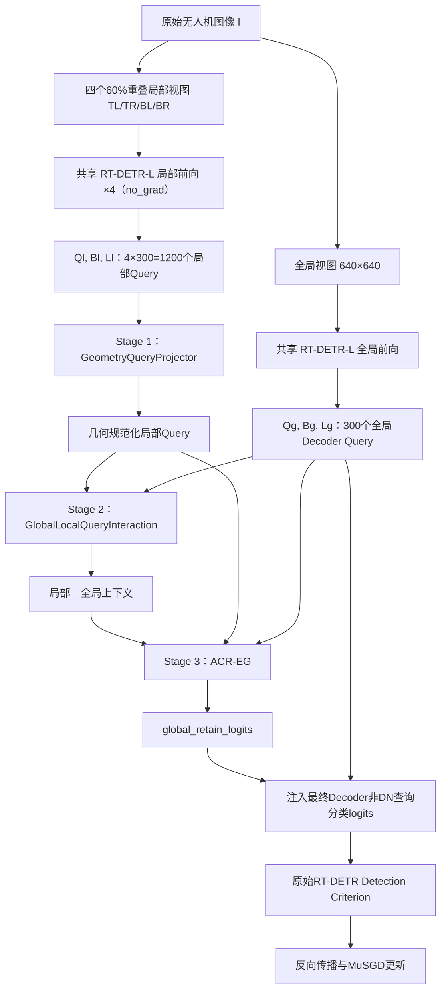

# GCTE-RTDETR / GCQF / ACR-EG 完整技术、实验与后续交接

> 文档类型：事实冻结、实验续跑、论文方法设计三合一交接<br>
> 生成日期：2026-07-28（Asia/Shanghai）<br>
> 当前代码分支：`codex/gcte-rtdetr-g0`<br>
> 当前真正集成源码提交：`a22838e3e7cd1cd858d6aad9f42e5b68fab50471`<br>
> 当前正式模型状态：真正 YAML 配置、Decoder Query 级接入，100 epoch 暖启动训练进行中<br>
> 最重要原则：本文档严格区分历史现象证据、缓存模块诊断和当前端到端集成训练，禁止跨实验口径混写指标。

---

## 0. 一页结论

### 0.1 现在真正做成了什么

当前已经做成的不是纯规则 SADED，也不是只读取最终框进行重排的后处理，而是一个真正接入 RT-DETR 主模型的查询级网络结构模块：

```text
整体模型：GCTE-RTDETR
核心三阶段网络模块：GCQF
├── Stage 1：GeometryQueryProjector
├── Stage 2：GlobalLocalQueryInteraction
└── Stage 3：AnchorConditionedResidualEvidenceGate（ACR-EG）
```

工程中使用 `ACREGDetectionModel(RTDETRDetectionModel)` 作为正式模型类，在一个全局视图和四个局部视图上提取最终 Decoder Query；GCQF 处理局部 Query、全局 Query 和几何信息，输出每个全局 Query 的保留残差，并在原始 RT-DETR 检测损失计算前注入最后一层 Decoder 分类 logits。

因此按科研语境中的“网络模块”标准，当前实现属于：

> **A：查询级网络结构融合模块。**

它满足：

- 输入包含 RT-DETR 最终 Decoder Query 和中间查询证据；
- 继承 `nn.Module`，包含可训练参数；
- 在主模型 `predict()` / `loss()` 路径中调用；
- 进入主模型 `state_dict()`、MuSGD optimizer 和 checkpoint；
- 输出在 RT-DETR criterion 之前生效；
- 不是只读取最终 boxes/scores 后独立重排。

### 0.2 当前科学结论到了哪一步

目前已经有三层不同强度的证据：

1. **SADED-SM 现象证据成立**：局部高分辨率视图确实能显著补充 tiny 目标，但 SADED-SM 本身是训练无关推理路由，不是最终网络创新模块。
2. **冻结 Query 缓存上的 GCQF/ACR-EG 模块诊断成立**：相对 Global RT-DETR-L，mAP、AP-tiny 和 tiny recall 均有正增益，medium/large 满足保护预算。
3. **当前真正 YAML 集成模型已经进入 100 epoch 训练**：网络注册、Query 前向、检测损失反传、optimizer 和 checkpoint 证据均已通过；但是尚未完成 100 epoch，也尚未运行当前 checkpoint 的真实端到端冻结验证，所以不能宣称正式 mAP 已提升。

### 0.3 当前训练与备份快照

截至 2026-07-28 18:16（UTC+8）的只读服务器快照：

- 正式进程 PID：`31100`
- 已完成：`9/100 epoch`
- 正在运行：第 `10` 轮
- GPU：RTX 4090，训练进程仍真实占用 GPU
- 服务器 `/home`：约 `12 GB` 可用
- 服务器已有：`epoch0.pt` 至 `epoch8.pt`、`last.pt`、`best.pt`

当前最新的 GitHub 恢复锚点是完成第 9 轮：

- Ultralytics 文件名：`epoch8.pt`
- checkpoint 内部 epoch：`8`
- 文件大小：`205,325,084` bytes
- SHA256：`802D72326F4B8FEE55C0FF8818A5B96B7445CBEE34F5C1ED9002A6D3E6771FE6`
- 本地备份：`artifacts/gcte-acr-eg-a22838e3/epoch8.pt`
- GitHub Release：
  <https://github.com/kkc236/uav-detection-baselines/releases/tag/gcte-acr-eg-a22838e3-epoch-009>

该 Release 的 GitHub digest、资产大小、本地 SHA256 和服务器 SHA256 已完全一致。第 4、7、9 轮均已有独立 Release。全新服务器安装、镜像、数据迁移、checkpoint 身份检查及安全恢复边界见：

```text
docs/handoffs/2026-07-28-gcte-acr-eg-clean-server-migration-and-resume.md
```

2026-07-28 18:33 的后续 SSH 只读检查在 protocol banner 阶段连续断开，故没有比 18:16 更新的可信服务器状态；最后可靠恢复点仍为已完成三方哈希闭环的第 9 轮。

### 0.4 还没有做成的部分

以下内容尚未完成，不能提前写成论文结果：

- 当前集成 checkpoint 的 548 图真实端到端 mAP/AP-tiny 评估；
- 100 epoch 完整训练；
- 与同等总训练预算的 matched control 公平比较；
- 当前正式 loss 对全部 ACR-EG 参数的逐参数非零梯度审计；
- local score residual / local boxes 直接进入最终检测结果；
- 真实参数量、FLOPs、端到端延迟和显存主表；
- 多 seed、第二数据集、test-dev 或 SOTA 结论；
- 创新点 2 和创新点 3 的最终冻结。

---

## 1. 项目目标与当前论文定位

项目最终目标是形成一篇 CCF-C 级无人机小目标检测论文。论文最终需要三个可独立消融、可画入网络结构图、参与前向传播和训练更新的网络创新模块。

当前工作集中在创新点 1。创新点 1 的现实问题为：

> 无人机航拍图像中的微小目标在整图缩放到 640×640 后有效像素不足，细节和辨识线索丢失；局部高分辨率视图能够恢复 tiny 目标证据，但不同视图坐标、语义上下文和候选可靠性不一致，直接拼接或简单特征相加容易引入噪声并破坏原有全局检测能力。

当前创新点 1 的目标不是再做一个纯切片后处理，而是把已由 SADED 证明有效的多视图 tiny 证据转化为可训练 Query 级网络机制：

1. 在局部视图中获取高分辨率 tiny 证据；
2. 把局部 Query 几何规范化到全局坐标系；
3. 让局部 Query 读取全局 Query 语义上下文；
4. 使用锚点条件残差门控制局部证据对全局 Query 的影响；
5. 在 RT-DETR 检测损失之前注入结果并参与反向传播。

当前论文命名建议固定为：

| 层级 | 建议名称 | 代码中的对应关系 |
|---|---|---|
| 整体模型 | **GCTE-RTDETR**：Geometry-Canonical Tiny-Evidence RT-DETR | `ACREGDetectionModel` |
| 核心大模块 | **GCQF**：Geometry-Canonicalized Constrained Query Fusion | `src/gcqf.py` 中的 `GCQF` 类 |
| 第一阶段 | **GQP**：Geometry Query Projector | `GeometryQueryProjector` |
| 第二阶段 | **GLQI**：Global-Local Query Interaction | `GlobalLocalQueryInteraction` |
| 第三阶段 | **ACR-EG**：Anchor-Conditioned Residual Evidence Gate | `AnchorConditionedResidualEvidenceGate` |

必须避免名称混用：

- 工程属性名 `self.acr_eg` 实际注册的是完整 `GCQF`；
- 设计上 ACR-EG 只是 GCQF 的第三阶段；
- 论文中建议将“GCQF”作为创新点 1 的完整大模块，将“ACR-EG”作为第三阶段名称。

---

## 2. 从旧方案到当前方案的完整演进

### 2.1 早期三模块路线

项目早期实现过 BTD-SE、IOQC-SA、VSF-RMR 三个网络模块。它们均具备可训练参数和端到端训练能力，但在严格 matched RT-DETR-L baseline 下没有形成稳定正增益：

| 模型 | 当时 best mAP50-95 | matched baseline 约值 | 结论 |
|---|---:|---:|---|
| Matched RT-DETR-L | 约 0.241–0.242 | — | 对照 |
| BTD-SE | 0.19867 | 约低 0.043 | 不可作为成功创新 |
| IOQC-SA | 0.23335 | 约低 0.008 | 最接近 baseline，但仍未超过 |
| VSF-RMR | 0.20374 | 约低 0.038 | 不可作为成功创新 |

该阶段证明了工程系统和训练系统能够工作，但没有证明原三个创新点具有论文级正收益，因此后续没有继续把它们机械堆叠。

### 2.2 SADED-SM：有效现象，但不是网络结构创新

SADED-SM 的核心是：

```text
同一个 RT-DETR-L
├── 全图 640 推理
└── 四个局部高分辨率视图推理
     └── tiny 尺度路由、全局目标保护和候选融合
```

在权威 Fresh100 seed0 的同一 100-epoch detector 端点上，Arm A 到 SADED-SM 的变化为：

| 指标 | Arm A | SADED-SM | Delta |
|---|---:|---:|---:|
| mAP50-95 | 0.072566 | 0.087968 | **+0.015402** |
| AP50 | 0.166685 | 0.214744 | **+0.048059** |
| AP75 | 0.057509 | 0.063757 | **+0.006248** |
| AP-tiny-SBR | 0.009811 | 0.028491 | **+0.018680** |
| tiny recall | 0.222517 | 0.389737 | **+0.167220** |
| AP-small-SBR | 0.059173 | 0.049517 | -0.009656 |
| AP-medium-SBR | 0.169371 | 0.160876 | -0.008495 |
| AP-large-SBR | 0.146393 | 0.145965 | -0.000428 |

这组结果只能支持：

> 局部高分辨率多视图能够产生真实有效的 tiny 检测证据，并基本保护 large 目标。

它不能支持：

- 所有尺度都提升；
- SADED-SM 是新的 RT-DETR 网络；
- 推理路由本身就是最终网络结构创新。

还必须注意：上述 Fresh100 端点与后续成熟 matched baseline、冻结 Query cache 的绝对 mAP 口径不同，不能跨表直接比较绝对数值。

### 2.3 GCMV-EI / P3 特征注入：网络化尝试失败

随后曾尝试 PLEC + GGLF + PEG 的 P3 特征注入路线。其局部模块工程验证成立，但检测作用近乎被关闭：

- Method-On − Method-Off AP-tiny：`-0.000002`
- Method-On − Method-Off mAP50-95：`+0.000014`
- `gamma=0.020734`，接近初始化值 `0.02`
- gate 均值：`0.008182`
- 平均有效残差约：`gamma × gate ≈ 0.00017`
- Method-Off − Control AP-large：`-0.020910`

这说明：

1. 局部 P3 注入没有形成足够强的直接检测贡献；
2. 辅助训练却让全局检测器发生漂移；
3. 问题不适合继续靠调 `gamma` 或门权重解决；
4. 因此停止 P3 特征注入，转向 Decoder Query 证据层。

### 2.4 旧 GCQF / SR-PEG：方向有效，但硬门过度拒绝

旧 GCQF 包含：

1. `GeometryQueryProjector`
2. `GlobalLocalQueryInteraction`
3. 旧 `ScaleRiskProtectedEvidenceGate`

在 548 图冻结 Query cache 上，相对 Global RT-DETR-L：

| 指标 | Full − Global |
|---|---:|
| mAP50-95 | **+0.010595** |
| AP-tiny-SBR | **+0.013412** |
| tiny recall | **+0.054338** |
| AP-medium-SBR | -0.001640 |
| AP-large-SBR | -0.000096 |

Global 相对安全门全部通过。但相对内部 Fixed-SADED 锚点：

| 指标 | Full − Fixed |
|---|---:|
| mAP50-95 | -0.016579 |
| AP-tiny-SBR | -0.030630 |
| AP-medium-SBR | +0.009265 |

覆盖统计揭示了根因：

- Fixed-SADED 接纳 local：`120,326`
- 旧学习门接纳 local：`23,283`
- Fixed 最终预测：`164,384`
- 旧学习门最终预测：`156,960`
- 空出的 `max_det` 槽：`7,440`

因此失败原因不是局部证据无效，而是旧第三阶段用多个硬阈值独立重建准入，过度丢弃了 Fixed 锚点中已被证明有效的 tiny 候选。

### 2.5 ACR-EG 修正

保留前两阶段，将第三阶段改为 ACR-EG：

- anchor membership 进入可学习 local trunk；
- 使用 `±log(3)` 的固定先验，对应 0.75/0.25 初始准入概率；
- 网络只学习锚点周围的有界残差；
- tiny utility、non-tiny risk 和 anchor residual 共同形成准入 logit；
- 使用容量感知排序，不再因独立硬阈值造成空槽；
- global retain 分支继续保护全局证据。

### 2.6 真正 YAML 集成

缓存模块验证通过后，进一步实现：

- `ACREGDetectionModel` 继承真实 RT-DETR 模型；
- 从 YAML 读取 `gcte` 配置；
- 捕获真实 RT-DETR 最后一层 Decoder Query；
- 同一模型处理全图和四局部图；
- GCQF 在主模型前向中运行；
- `global_retain_logits` 在原始 criterion 前注入分类 logits；
- 模块参数进入 optimizer、state_dict 和 detector checkpoint；
- 启动真正集成 100 epoch 训练。

---

## 3. 冻结 baseline、数据和训练协议

### 3.1 软件与硬件

| 项目 | 冻结值 |
|---|---|
| 基础模型 | Ultralytics RT-DETR-L |
| Ultralytics | 8.4.90 |
| GPU | NVIDIA GeForce RTX 4090，24 GB |
| 驱动 | 550.142 |
| Python | 3.10.12 |
| PyTorch | 2.5.1+cu121 |
| Torchvision | 0.20.1+cu121 |
| CUDA | 12.1 |

### 3.2 数据

| 项目 | 冻结值 |
|---|---|
| 数据集 | VisDrone train/val |
| 训练图像 | 6,471 |
| 验证图像 | 548 |
| 类别数 | 10 |
| 用户冻结数据集 SHA256 | `FD92E9FF4B3B58FCDD5A32F7E770FC3398E566B627DB0E188CB5FF9F3B7BBDAB` |
| 548 图验证签名 | `A9A0C00DC640BCAAEFE9360F5E3B55382E74E169B5AEEF15EB1F0AE2A571228A` |
| 固定 10% 子集 | 647 图 |
| 10% 子集签名 | `52660F55552FFD953E2EE26F55FD0A1CB14217DBBEA0F5F3B981C3514F8D93A0` |

### 3.3 检测与优化协议

| 参数 | 冻结值 |
|---|---|
| 正式 epoch | 100 |
| imgsz | 640 |
| batch | 8 |
| workers | 8 |
| device | 0，单卡 |
| AMP | True |
| 固定 AMP scale | 128 |
| seed | 当前正式训练为 0 |
| deterministic | True |
| cache | False |
| optimizer | MuSGD |
| lr0 | 0.01 |
| lrf | 0.01 |
| momentum | 0.937 |
| weight decay | 0.0005 |
| warmup epochs | 3.0 |
| warmup momentum | 0.8 |
| warmup bias lr | 0.0 |
| nbs | 64 |
| cos_lr | False |
| query 数 | 300 |
| max_det | 300 |
| NMS | False |
| mosaic | 1.0 |
| close_mosaic | 10 |
| mixup | 0.0 |
| scale | 0.5 |
| translate | 0.1 |
| degrees / shear / perspective | 0 / 0 / 0 |
| flipud / fliplr | 0 / 0.5 |
| hsv_h / hsv_s / hsv_v | 0.015 / 0.7 / 0.4 |
| cutmix / copy_paste | 0 / 0 |

### 3.4 初始化语义必须严格区分

用户冻结的原始 matched baseline 是：

```text
RT-DETR-L
pretrained=False
完整 VisDrone
100 epoch
```

成熟 baseline checkpoint：

```text
SHA256 =
54CE60289DD34C6750B8BA5F7516EEFCF3AFEF6C174C6E4F3B1EF810C883099B
```

当前集成训练虽然配置字段仍记录 `pretrained=False`，但真实初始化是：

```text
成熟 100-epoch baseline 的 stock RT-DETR 参数
        +
新初始化、零残差初始化的 GCQF/ACR-EG 参数
        ↓
继续进行 100 epoch 集成训练
```

所以当前实验属于：

> **mature-baseline warm-start 集成训练。**

它不是“method 从随机初始化训练 100 epoch”。如果将其作为论文主结果，必须提供同等总训练预算的 matched control：

```text
Control：
成熟 baseline → 不加 GCQF → 再训练相同轮数

Method：
同一个成熟 baseline → 加 GCQF → 再训练相同轮数
```

或者未来重新运行：

```text
Baseline 与 Method 均从随机初始化、各训练 100 epoch。
```

当前训练不应中断，但最终论文比较必须补齐该公平性。

---

## 4. 当前 YAML 与模型注册方式

正式 YAML：

`configs/rtdetr-l-acr-eg.yaml`

核心配置：

```yaml
gcte:
  enabled: true
  forward_integration: true
  query_dim: 256
  num_classes: 10
  num_heads: 8
  num_views: 4
  residual_eta: 0.2
  residual_enabled: true
  acr_eg_off: false
  gcte_off: false
```

YAML SHA256：

```text
D86A166A7166C18FDB9603180A2C65C60A0B1A4BE663CE4A088E14574F7CF422
```

必须准确描述其接入方式：

> GCQF 是 YAML-declared / YAML-configured registered module。YAML 提供参数和开关，Python 模型类读取配置后以 `self.acr_eg = GCQF(...)` 注册。它目前不是直接写在 Ultralytics `head:` 列表中的原生 `parse_model` 图节点。

当前 YAML 顶层仍写有 `nc: 80`，正式 trainer 构造模型时以 VisDrone `nc=10` 覆盖，因此实际运行类别数为 10。后续冻结论文配置时应把 YAML 文本也改为 `nc: 10`，消除“文本值与运行时覆盖值不同”的复现歧义；当前正在运行的提交不得原地修改。

---

## 5. 整体架构与数据流



张量规模：

\[
Q_g\in\mathbb R^{B\times300\times256}
\]

\[
Q_l\in\mathbb R^{B\times1200\times256}
\]

其中：

- 全局视图输出 300 个 Query；
- 每个局部视图输出 300 个 Query；
- 四局部视图共 1200 个 Query；
- 类别数为 10；
- 最终 `max_det=300`。

---

## 6. 多视图构造算法

### 6.1 四局部视图

对原图宽高 \(W,H\)，局部块大小为：

\[
W_t=\lceil0.6W\rceil,\qquad H_t=\lceil0.6H\rceil
\]

四个局部块为：

\[
T_{TL}=(0,0,W_t,H_t)
\]

\[
T_{TR}=(W-W_t,0,W,H_t)
\]

\[
T_{BL}=(0,H-H_t,W_t,H)
\]

\[
T_{BR}=(W-W_t,H-H_t,W,H)
\]

由于每块覆盖原图宽高的 60%，相邻局部块具有约 20% 原图尺寸的重叠，有利于减少目标恰好落在切片边缘的概率。

### 6.2 网络输入

当前正式代码中：

- 全局视图输入 640×640；
- 每个局部视图也 letterbox 到 640×640；
- 局部视图不是旧设计稿中的 1088；
- 四个局部视图共享同一个 RT-DETR-L 参数；
- 没有额外训练第二个完整 tiny detector；
- 局部前向按四个视图依次运行。

局部分支使用：

```python
with torch.no_grad(), preserve_batchnorm_buffers(self):
    ...
```

并对局部 Query、box 和 logits 执行 `detach()`。因此：

- 局部检测器本身不接收反向梯度；
- BatchNorm running buffer 不被局部前向污染；
- 全局 RT-DETR 主分支仍由检测损失更新；
- GCQF 参数通过全局保留 logit 注入路径接收梯度。

---

## 7. Stage 1：GeometryQueryProjector

### 7.1 输入

对第 \(i\) 个局部 Query：

- Query 表示 \(q_i^l\in\mathbb R^{256}\)
- 分类 logits \(\ell_i^l\)
- 局部归一化框 \(b_i^l=(x,y,w,h)\)
- 基础质量：

\[
s_i^l=\max_c\sigma(\ell_{i,c}^l)
\]

- 局部到全局单应矩阵 \(H_v\)
- 6 维 crop metadata

### 7.2 框的几何映射

局部框不能只映射中心点。代码先把 \(xywh\) 还原成四个角点，经单应矩阵变换，再取变换后四角的轴对齐包围框：

\[
\widetilde b_i^l=\mathcal T(H_v,b_i^l)
\]

### 7.3 几何描述向量

原始几何向量由以下内容组成：

- 4 维全局框 \(\widetilde b_i^l\)
- 6 维 crop metadata
- 4 维局部框到 crop 四边的归一化距离
- 1 维 local base score

因此：

\[
z_i=[\widetilde b_i^l,m_v,d(b_i^l),s_i^l]\in\mathbb R^{15}
\]

使用固定正余弦展开：

\[
\phi(z_i)=
[z_i,\sin(2\pi z_i),\cos(2\pi z_i)]
\in\mathbb R^{45}
\]

### 7.4 几何嵌入

```text
45
→ Linear(45,256)
→ GELU
→ Linear(256,256)
→ LayerNorm
```

\[
e_i=\operatorname{LN}
\left(
W_2\operatorname{GELU}(W_1\phi(z_i))
\right)
\]

### 7.5 Query 几何适配

```text
[local query 256, geometry embedding 256]
→ Linear(512,256)
→ GELU
→ Linear(256,256)
→ tanh × 0.2
```

\[
r_i^q=
0.2\tanh
\left(
A_2\operatorname{GELU}
\left(A_1[q_i^l,e_i]\right)
\right)
\]

\[
\bar q_i^l=
\operatorname{LN}(q_i^l+r_i^q)
\]

最后一层适配器零初始化，所以初始行为接近 identity residual，降低突然破坏成熟 Query 表示的风险。

参数量与 state keys：

| 项目 | 数值 |
|---|---:|
| 参数量 | 275,712 |
| state_dict keys | 12 |

---

## 8. Stage 2：GlobalLocalQueryInteraction

### 8.1 目的

同一个局部纹理可能是真 tiny 目标，也可能是道路纹理、建筑边缘或局部碎片。仅凭局部 Query 难以判断，需要读取全局 Query 提供的类别、上下文和完整目标信息。

### 8.2 全局位置编码

全局框经过：

```text
4 → Linear(4,256) → GELU → Linear(256,256)
```

形成：

\[
k_j^g=q_j^g+\psi(b_j^g),
\qquad
v_j^g=q_j^g
\]

### 8.3 Cross-Attention

以 canonical local Query 为 query，以全局 Query 为 key/value：

\[
c_i=
\operatorname{LN}
\left(
\bar q_i^l+
\operatorname{MHA}
(\bar q_i^l,K_g,V_g)
\right)
\]

配置：

- `query_dim=256`
- `num_heads=8`
- `dropout=0`
- `batch_first=True`

全局 Query 作为证据输入时被 `detach()`，但该阶段自身的 attention 和位置 MLP 是可训练的。

参数量与 state keys：

| 项目 | 数值 |
|---|---:|
| 参数量 | 330,752 |
| state_dict keys | 10 |

---

## 9. Stage 3：Anchor-Conditioned Residual Evidence Gate

### 9.1 tiny anchor

局部框映射到全局 640 有效尺度后，定义：

\[
a_i=
\mathbf 1
\left(
640\sqrt{w_i h_i}\le16
\right)
\]

其中 \(a_i\) 是布尔 anchor membership。它来自已验证 SADED 尺度边界，是网络输入和先验，不是最终学习输出。

### 9.2 local trunk

每个局部 Query 拼接：

\[
x_i=
[\bar q_i^l,c_i,e_i,s_i^l,a_i]
\]

维度为：

\[
3D+2=3\times256+2=770
\]

网络：

```text
770
→ Linear(770,256)
→ GELU
→ Linear(256,256)
→ LayerNorm
```

\[
h_i=f_h(x_i)
\]

### 9.3 四个局部预测头

```text
tiny_utility_head:   Linear(256,1)
non_tiny_risk_head:  Linear(256,1)
anchor_delta_head:   Linear(256,1)
score_residual_head: Linear(256,1)
```

全部输出层零初始化。

tiny utility：

\[
u_i=W_u h_i
\]

non-tiny risk：

\[
r_i=W_r h_i
\]

### 9.4 锚点先验

\[
\pi_i=
\begin{cases}
+\log3,&a_i=1\\
-\log3,&a_i=0
\end{cases}
\]

对应初始准入概率：

\[
\sigma(\log3)=0.75,\qquad
\sigma(-\log3)=0.25
\]

### 9.5 锚点条件准入残差

\[
\Delta_i=
\log3\cdot\tanh(W_a h_i)
\]

\[
\lambda_i^{adm}
=
\pi_i+\Delta_i+0.5u_i-0.5r_i
\]

解释：

- anchor 给出保守初始偏置；
- tiny utility 提高准入；
- non-tiny risk 降低准入；
- anchor delta 在有限范围内纠正固定规则；
- 网络不会在初始化时立刻彻底推翻所有 Fixed anchor 候选。

### 9.6 局部分数残差

\[
\rho_i=\tanh(W_s h_i)
\]

仅 anchor eligible 候选允许残差：

\[
s_i'=
\min
\left(
1,
s_i^l\exp(\eta\rho_i)
\right),
\qquad
\eta=0.2
\]

### 9.7 global retain 分支

每个全局 Query 反向读取 canonical local Queries：

\[
t_j^g=
\operatorname{MHA}
(q_j^g,\bar Q_l,\bar Q_l)
\]

计算全图局部准入统计：

\[
\bar p=
\frac{
\sum_i
\sigma(\lambda_i^{adm})m_i
}{
\sum_i m_i
}
\]

其中 \(m_i\) 是 local valid mask。

全局框使用 64 维编码：

```text
4 → Linear(4,64) → GELU → Linear(64,64)
```

retain feature：

\[
y_j=
[q_j^g,t_j^g,\psi_b(b_j^g),s_j^g,\bar p]
\]

retain head：

```text
2×256 + 64 + 2 = 578
→ Linear(578,256)
→ GELU
→ Linear(256,1)
```

\[
g_j=f_g(y_j)
\]

参数量与 state keys：

| 项目 | 数值 |
|---|---:|
| 参数量 | 680,837 |
| state_dict keys | 26 |

---

## 10. GCQF 总参数和网络注册证据

| 阶段 | 参数量 | state_dict keys |
|---|---:|---:|
| GeometryQueryProjector | 275,712 | 12 |
| GlobalLocalQueryInteraction | 330,752 | 10 |
| ACR-EG | 680,837 | 26 |
| **GCQF 合计** | **1,287,301** | **48** |

全部新增参数 `requires_grad=True`。

证据链：

1. `ACREGDetectionModel` 继承 `RTDETRDetectionModel`；
2. `self.acr_eg = GCQF(...)` 以子模块方式注册；
3. `model.state_dict()` 中存在 48 个 `acr_eg.*` key；
4. MuSGD optimizer 包含 ACR-EG 参数；
5. detector checkpoint 同时包含 stock RT-DETR 和 ACR-EG 参数；
6. 单元测试验证 logit 注入能向 retain logit 反传；
7. GCQF 单元测试验证三个阶段可获得梯度；
8. 真实 denoising-query forward/backward smoke 发现非零 ACR-EG 梯度。

正式启动证据记录于：

`docs/evidence/gcte-acr-eg-integrated-formal-launch.json`

---

## 11. 当前真正接入 RT-DETR 的算法

### 11.1 捕获最终 Decoder Query

在 RT-DETR Decoder 最后一层注册临时 forward hook，获取未 detach 的最终 Query。

仅保留最后 300 个非 denoising Query：

\[
Q_g=Q_{\mathrm{decoder}}[:,-300:,:]
\]

### 11.2 四局部证据

四个局部视图共获得：

\[
Q_l=
\operatorname{Concat}
(Q_{TL},Q_{TR},Q_{BL},Q_{BR})
\in\mathbb R^{B\times1200\times256}
\]

同时拼接 local boxes、logits 和 quality。

### 11.3 GCQF 前向

\[
O_{\mathrm{GCQF}}
=
\operatorname{GCQF}
(E_g,E_l,G,a)
\]

输出：

- `canonical_local`
- `geometry_embedding`
- `global_context`
- `tiny_utility_logits`
- `non_tiny_risk_logits`
- `anchor_admission_logits`
- `global_retain_logits`
- `score_residual`
- `adjusted_local_scores`

### 11.4 当前正式 logit 注入

当前真正送入主检测损失的只有：

```python
output.global_retain_logits
```

只修改最终 Decoder 层最后 300 个非 DN Query：

\[
\widehat \ell_{j,c}
=
\ell_{j,c}
+
\alpha\tanh(g_j),
\qquad
\alpha=0.2
\]

同一个 Query 级标量会广播到该 Query 的全部类别 logits。其作用更接近“Query 保留/存在性置信度残差”，而不是改变 Query 的具体类别相对关系。

以下部分保持不变：

- 前面 Decoder 层；
- denoising query 前缀；
- box 输出；
- stock RT-DETR criterion 结构。

### 11.5 当前正式损失

\[
\mathcal L_{\mathrm{formal}}
=
\mathcal L_{\mathrm{RTDETR}}
(\widehat L,B;\mathrm{GT})
\]

原始 detection loss 包含：

- GIoU loss
- classification loss
- L1 box loss

`acr_eg_gate` 目前只是：

```python
abs(global_retain_logits).mean().detach()
```

它是日志诊断量，不是额外优化项。

因此当前正式实现的最准确表述是：

> **局部多视图证据条件化的全局 Decoder Query 保留增强网络。**

当前不应表述为：

> “local boxes 已直接端到端并入最终预测集合。”

---

## 12. 缓存模块训练与当前正式训练的区别

### 12.1 已完成的 10-epoch 模块-only 诊断

冻结成熟 detector，缓存全局和局部 Query，只训练 GCQF。固定 647 图按 seed0 哈希拆分：

- train：518
- calibration holdout：129

模块-only loss：

\[
\mathcal L_{\mathrm{GCQF}}
=
\mathcal L_{quality}
+0.1\mathcal L_{equiv}
+0.01\mathcal L_{residual}
+1.0\mathcal L_{tiny}
+2.0\mathcal L_{risk}
+2.0\mathcal L_{retain}
+1.0\mathcal L_{admission}
\]

其中：

- `quality`：调整后 local score 与同类 GT IoU 目标；
- `equivariance`：不同视图同一 GT Query 的余弦一致性；
- `residual`：score residual 正则；
- `tiny`：local tiny utility BCE；
- `risk`：local non-tiny fragment risk BCE；
- `retain`：global small-query retain BCE；
- `admission`：anchor-conditioned admission BCE。

模块-only checkpoint：

```text
commit:
c966512f537d5671a6fd06584cd2774406e96320

best-module SHA256:
427A7062A95F6EA44BF9F4FE67C88D1FD7DD0E64E2D7BCD2397016E0782A8A86
```

训练结果：

- 10/10 epoch 完成；
- final train loss：`2.13051138`
- final calibration loss：`2.29111369`

### 12.2 当前 100-epoch 真正集成训练

当前训练不再读取缓存 Query，而是真实运行：

```text
global RT-DETR forward
+ 4 × local RT-DETR forward
+ GCQF forward
+ logit injection
+ stock RT-DETR loss
```

当前没有显式加入上述多项 GCQF auxiliary loss。其主要梯度来源是注入后的 stock detection criterion。

必须注意：

- `tiny_utility_logits`、`non_tiny_risk_logits` 和 `anchor_admission_logits` 通过准入统计影响 `global_retain_logits`，存在间接检测损失路径；
- `score_residual` 和 `adjusted_local_scores` 当前没有进入最终 logits/boxes 或 detection loss；
- 因而 `score_residual_head` 虽然在 optimizer/state_dict/checkpoint 中，但当前正式 detection-only 路径预计没有有效梯度；
- 单元测试中通过“把所有 GCQF 输出求和”验证所有头有梯度，不等于当前正式 detection loss 已验证所有头有梯度。

后续必须运行一次真实 formal loss 的逐参数梯度审计。

---

## 13. 已验证的软件与网络性质

### 13.1 已通过

- `ACREGDetectionModel` 是真实 RT-DETR 子类；
- YAML `gcte` block 能被解析并注册 GCQF；
- 48 个 `acr_eg.*` state keys；
- 新增参数 1,287,301；
- optimizer 包含 ACR-EG 参数；
- final Decoder Query hook 能运行；
- 300 个非 DN Query 选择正确；
- DN metadata 字典契约已修复；
- Query retain logit 注入只改变最终 Decoder 层和非 DN Query；
- 注入操作能向 retain logits 反向传播；
- 三个 GCQF 子阶段均有独立单元梯度测试；
- 几何映射支持 crop translation 和 flip；
- anchor mask 形状、类型和分数范围错误会 fail closed；
- residual 初始为数值 no-op；
- 局部 BatchNorm buffers 被保护；
- 正式服务器 focused regression：`16 passed`；
- 真实 DN forward/backward smoke 通过，并观测到 ACR-EG 非零梯度；
- 正式训练已经完成多个真实 epoch 并产生包含 ACR-EG 的 checkpoint。

### 13.2 曾发生并已修复的软件问题

第一次真正集成启动在首批数据前失败，因为 RT-DETR 的 `dn_meta` 是字典，而最初校验器只允许 Tensor/None。

修复过程：

1. 复现 raw training output 契约；
2. 增加失败测试；
3. 接受 `dict | None` 的 DN metadata；
4. 提交 `a22838e3`；
5. focused tests 通过；
6. 在新源码目录、新输出目录重新启动；
7. 正式训练进入真实 batch。

该问题属于工程契约修复，不是科学调参。

---

## 14. 已完成的算法诊断结果

### 14.1 ACR-EG 129 图 calibration holdout

相对 Global：

| 指标 | Delta |
|---|---:|
| mAP50-95 | +0.009688 |
| AP-tiny | +0.012339 |
| tiny recall | +0.075178 |
| AP-medium | -0.000537 |
| AP-large | +0.000435 |

这只是 calibration holdout 诊断，不是最终验证结果。

### 14.2 ACR-EG 548 图冻结 Query cache 评估

绝对指标：

| 指标 | Global | Full-GCQF | Fixed-SADED |
|---|---:|---:|---:|
| mAP50-95 | 0.198699 | 0.208893 | 0.225872 |
| AP50 | 0.361808 | 0.389978 | 0.416509 |
| AP75 | 0.185303 | 0.189841 | 0.207848 |
| AP-tiny-SBR | 0.080789 | 0.094000 | 0.124831 |
| tiny recall | 0.582079 | 0.640291 | 0.681828 |
| AP-medium-SBR | 0.257805 | 0.256281 | 0.246901 |
| AP-large-SBR | 0.154643 | 0.154553 | 0.152511 |

Full-GCQF − Global：

| 指标 | Delta | 冻结门 | 结果 |
|---|---:|---:|---|
| mAP50-95 | **+0.010194** | ≥ +0.005 | PASS |
| AP-tiny-SBR | **+0.013211** | ≥ +0.010 | PASS |
| tiny recall | **+0.058212** | ≥ +0.020 | PASS |
| AP-medium-SBR | -0.001524 | ≥ -0.002 | PASS |
| AP-large-SBR | -0.000090 | ≥ -0.005 | PASS |

内部 Full-GCQF − Fixed-SADED：

| 指标 | Delta |
|---|---:|
| mAP50-95 | -0.016979 |
| AP-tiny-SBR | -0.030831 |
| tiny recall | -0.041538 |
| AP-medium-SBR | +0.009380 |
| AP-large-SBR | +0.002042 |

Fixed-SADED 是未公开的内部规则锚点，不是外部论文 baseline。它用于检查学习门有没有丢失已有局部证据，不应取代原始 Global RT-DETR-L 成为唯一主比较对象。

覆盖统计：

| 状态 | accepted local | final predictions | 其他 |
|---|---:|---:|---|
| Fixed anchor | 120,326 | 164,384 | capacity rejected 50,925 |
| Full-GCQF | 26,678 | 164,177 | protected global 63,355 |
| Residual-Off | 32,438 | 164,250 | capacity rejected 23,869 |

已通过的缓存评估不变量：

- Global-relative 5 个指标门；
- anchor reference exact；
- protected global exact；
- max_det respected；
- residual active；
- residual not saturated。

### 14.3 这些指标能证明什么

可以证明：

- 多视图 Query 证据具有真实 tiny 价值；
- GCQF/ACR-EG 的缓存模块路线相对 Global 方向成立；
- medium/large 可以在预设预算内被保护；
- anchor-conditioned 修正没有破坏已验证不变量。

不能证明：

- 当前正在训练的 `a22838e3` 集成 checkpoint 已达到同样指标；
- 当前正式模型已经超过 mAP 0.24170 的成熟 baseline；
- current integrated score residual 已产生检测贡献；
- 当前模型已经完成论文级公平对照。

---

## 15. 当前 100-epoch 集成训练

### 15.1 权威身份

```text
source commit:
a22838e3e7cd1cd858d6aad9f42e5b68fab50471

server source:
/home/ubuntu/gcte-acr-eg-formal-a22838e3

server output:
/home/ubuntu/gcte-acr-eg-formal-output-a22838e3/
acr-eg-integrated-rtdetr-100

source archive SHA256:
2091D21CD2E9E23621542F9F9EC668C32B1E1A068B5950292B1DB601D250809B
```

### 15.2 已完成训练记录

当前 `results.csv` 已记录：

| Epoch | 累计时间/s | train GIoU | train cls | train L1 |
|---:|---:|---:|---:|---:|
| 1 | 991.793 | 1.02127 | 0.43535 | 0.10810 |
| 2 | 1823.06 | 1.17069 | 0.39081 | 0.12148 |
| 3 | 2616.06 | 1.44023 | 0.31120 | 0.17442 |
| 4 | 3399.86 | 1.48489 | 0.30606 | 0.18620 |
| 5 | 4182.24 | 1.54681 | 0.28950 | 0.20752 |

这些训练 loss 受 warmup、matcher 和联合参数更新影响，不能单独判断最终检测性能。

### 15.3 为什么 `results.csv` 中指标为 0

当前配置明确：

```python
val=False
```

并且：

```python
ACREGFormalTrainer.validate() -> ({}, -inf)
ACREGFormalTrainer.final_eval() -> None
```

所以逐轮：

- precision = 0
- recall = 0
- mAP50 = 0
- mAP50-95 = 0

这些零值只是“未运行验证”，绝不是模型 AP 为 0。

同样，由于没有真实 fitness，当前训练期 `best.pt` 不应被解释为“验证集最优权重”。恢复优先使用明确 epoch checkpoint 或 `last.pt`。

---

## 16. 当前备份与恢复状态

### 16.1 源码和配置

- GitHub：`kkc236/uav-detection-baselines`
- 分支：`codex/gcte-rtdetr-g0`
- 真正集成代码提交：`a22838e3`
- 当前文档分支 HEAD 在生成本文档前：`f4225737`
- 集成启动 JSON：`docs/evidence/gcte-acr-eg-integrated-formal-launch.json`

### 16.2 第 3 轮权重

三处一致：

| 位置 | 状态 |
|---|---|
| 服务器 `weights/epoch2.pt` | 已存在 |
| 本地 `artifacts/gcte-acr-eg-a22838e3/epoch2.pt` | 已存在 |
| GitHub Release `gcte-acr-eg-a22838e3-epoch-003` | 已正式发布 |

统一 SHA256：

```text
7AB2CAC3A58F9FAF7B014596891E611AC061D2D0BB12C7E1CCE1CFA0828A1A2B
```

### 16.3 其他轮次

- 第 1 轮本地文件已下载并校验；
- 第 1 轮 GitHub Release 目前曾处于空资产草稿状态，不能视作 GitHub 备份完成；
- 第 2 轮没有经过本地/GitHub闭环验证；
- 第 4、5 轮在快照时仅确认服务器存在；
- 不得因为文件名存在就声称已经完成 GitHub 备份；
- 只有 Release asset 大小、digest 和服务器 SHA256 一致才算完成。

### 16.4 当前恢复限制

虽然第 3 轮 checkpoint 已保存，但当前 `scripts/train_gcte_formal.py` 仍明确拒绝：

```python
--resume <integrated-checkpoint>
```

并抛出：

```text
GCTE_ACR_EG_RESUME_REQUIRES_INTEGRATED_CHECKPOINT
```

所以当前状态是：

> 权重文件已经安全保存，但一键安全 resume 入口尚未实现和验证。

下一台服务器开始前必须先：

1. 写失败测试，要求只接受真实 `ACREGDetectionModel` checkpoint；
2. 校验 checkpoint 中存在 `acr_eg.*` state；
3. 校验 source commit、YAML、baseline hash 和 epoch；
4. 保留 optimizer、scheduler、scaler 和 epoch 状态；
5. 在新源码目录、新输出目录试跑一个 batch；
6. 验证从第 4 轮继续，而不是错误重启到第 1 轮。

旧 `098da04c` stock RT-DETR 的 resume 示例不能用于当前真正集成模型。

---

## 17. 当前代码审计发现的关键边界与风险

### 17.1 当前只把 global retain 接入最终检测

当前正式路径没有把 local boxes 直接送进最终预测集合。

实际生效的是：

```text
local multi-view evidence
→ GCQF
→ global_retain_logits
→ global query classification logits
```

因此论文当前最安全的机制名称是：

> 局部多视图证据条件化的全局 Query 保留增强。

若要写“局部 tiny 候选直接补充最终检测”，必须进一步实现 local Query/box 的 decoder-level 插入或训练内统一候选融合。

### 17.2 score residual 正式梯度链尚未闭合

`score_residual` 和 `adjusted_local_scores` 在 GCQF 中被计算，但没有进入当前正式输出和 loss。

后果：

- 该参数头进入 state_dict/optimizer/checkpoint；
- 但当前 detection-only loss 预计不会更新它；
- `residual_enabled` 对当前正式预测可能没有实际影响；
- 缓存评估中的 Residual-Off 结论不能自动等价到当前正式模型。

### 17.3 两个关闭开关尚未形成设计中的三状态

设计意图：

- `GCTE-Off` → Global baseline
- `ACR-EG-Off` → Fixed anchor
- `Residual-Off` → 只关闭学习残差

当前真正集成代码中：

- `gcte_off` 会回退 stock global；
- `acr_eg_off` 也会回退 stock global；
- `residual_enabled=false` 不会关闭 global retain；
- 当前没有在 integrated forward 中恢复 Fixed-SADED 输出集合。

因此最终消融接口仍需补齐。

### 17.4 数据增强几何对齐风险

数据集已经记录：

- `source_to_global`
- `global_to_source`
- random perspective matrix
- flip decision

但当前 `ACREGDetectionModel.loss()` 只把：

- `local_views`
- `source_shape`

传入正式 paired forward。`_live_geometry()` 又只按 `source_shape` 重建固定 letterbox 几何，没有消费数据集记录的真实全局增强矩阵。

在以下增强下存在局部—全局几何错位风险：

- mosaic
- horizontal flip
- random perspective / translate / scale

尤其当前 `mosaic=1.0`。这不代表训练一定失败，但必须在最终论文前做真实 batch 的坐标一致性审计。更稳的修复方向是让 forward 直接消费 batch 中已经记录的 `source_to_global/global_to_source`。

### 17.5 暖启动公平性

当前方法从成熟 baseline 再训练 100 epoch，不能只和“原 baseline 的第 100 轮”比较并把全部差值归因于 GCQF。

必须补 matched continuation control 或重新 fresh100。

### 17.6 当前独立 evaluator 仍是缓存 evaluator

`scripts/evaluate_acr_eg_integrated.py` 当前只是给旧 `evaluate_gcqf_g0` 缓存评估加协议信息，不会：

- 加载当前 `epoch2.pt`；
- 真实跑全局 + 四局部 forward；
- 执行 current integrated logit injection；
- 输出当前模型真实 mAP；
- 测量真实端到端延迟。

所以必须实现新的 live-checkpoint evaluator。

### 17.7 默认 predict 可能静默回退 stock

如果 `predict()` 没有同时传：

- `local_views`
- `source_shapes`

当前代码会静默调用 stock RT-DETR predict。正式 evaluator 必须强制检查多视图输入，避免误把 Global 结果标成 Method。

### 17.8 计算成本

当前每张图需要：

- 1 次全局 RT-DETR forward；
- 4 次局部 RT-DETR forward；
- 1 次 GCQF。

局部视图当前按循环依次 forward。真实延迟可能显著高于 baseline，不能在没有实测前宣称 2–3 倍以内。

---

## 18. 当前允许与禁止的论文表述

### 18.1 现在可以写

- SADED-SM 实验证明局部高分辨率多视图能够恢复 tiny 目标证据；
- 提出三阶段 GCQF 网络模块；
- GCQF 读取全局和局部 RT-DETR Decoder Query；
- GeometryQueryProjector 学习局部 Query 的几何规范化残差；
- GlobalLocalQueryInteraction 使用 cross-attention 获取全局上下文；
- ACR-EG 使用 tiny anchor、utility、risk 和 global retain 建模证据可靠性；
- GCQF 作为注册 `nn.Module` 进入主模型 forward、state_dict、optimizer 和 checkpoint；
- current integrated 模型在 RT-DETR criterion 前注入 Query retain logit；
- 冻结 Query cache 诊断相对 Global 提升 mAP、AP-tiny 和 tiny recall；
- 第 3 轮真正集成 checkpoint 已完成 SHA256 闭环备份。

### 18.2 现在不能写

- 当前 integrated 100-epoch 模型已经超过 baseline；
- 当前 integrated 模型已经达到旧 cache 评估的 +0.01019 mAP；
- 所有尺度指标都提升；
- local boxes 已经直接端到端进入最终检测；
- score residual 已经在正式 loss 中学到有效作用；
- 当前 `best.pt` 是验证集最优；
- 当前训练和原始 100-epoch baseline 具有相同总训练预算；
- 延迟不超过 baseline 3 倍；
- 已完成三 seed、test-dev、第二数据集或 SOTA 对比；
- 旧 `098da04c` stock checkpoint 是 ACR-EG 权重；
- Fixed-SADED 是外部公开 baseline。

---

## 19. 接下来必须做什么

### P0：服务器关闭前/迁移时

1. 保留第 3 轮 GitHub Release，不删除；
2. 尽可能备份最新 `last.pt` 或最新完整 epoch；
3. 为每个已上传资产记录：
   - server SHA256
   - local SHA256
   - GitHub digest
   - asset bytes
   - source commit
   - epoch
4. 不删除 `best.pt`、`last.pt`、baseline checkpoint、YAML 和 protocol；
5. 服务器关闭后以第 3 轮为最低可靠恢复点。

### P1：实现安全集成 checkpoint resume

必须采用测试先行：

1. checkpoint 必须包含真实 `ACREGDetectionModel`；
2. 必须存在 48 个 `acr_eg.*` keys；
3. 不接受旧 stock `098da04c` checkpoint；
4. 恢复 optimizer、scheduler、scaler 和 epoch；
5. 强制新输出目录；
6. 恢复后跑一个真实 multi-view batch；
7. 检查 ACR-EG 非零梯度和 GPU 占用。

### P2：完成 100 epoch

续跑时必须保持：

- source commit 或其明确的 resume 修复提交；
- 同一 YAML 配置；
- mature baseline hash；
- 训练数据和签名；
- batch 8；
- MuSGD 参数；
- seed0；
- AMP scale 128；
- 数据增强协议；
- 真实多视图 forward。

### P3：实现真实 live-checkpoint evaluator

评估器必须：

1. 加载当前集成 checkpoint；
2. 强制模型类为 `ACREGDetectionModel`；
3. 强制 `local_views/source_shape` 存在；
4. 对 548 图真实运行 1+4 视图；
5. 报告：
   - mAP50-95
   - AP50
   - AP75
   - AP-tiny-SBR
   - tiny recall
   - AP-medium-SBR
   - AP-large-SBR
   - Precision / Recall
   - params
   - FLOPs
   - peak VRAM
   - latency / FPS
6. 输出 checkpoint/YAML/dataset SHA256；
7. 明确区分 cache evaluation 与 live evaluation。

### P4：公平对照

至少需要：

| 对照 | 初始化 | 训练轮数 |
|---|---|---:|
| Mature Control | 同一个成熟 baseline | 与 Method 继续相同轮数 |
| Integrated Method | 同一个成熟 baseline + GCQF | 相同轮数 |

正式论文优先再补：

| 对照 | 初始化 | 训练轮数 |
|---|---|---:|
| Fresh Baseline | pretrained=False | 100 |
| Fresh GCQF | pretrained=False | 100 |

### P5：修复或验证正式结构边界

按优先级：

1. 使用真实 `source_to_global/global_to_source` 解决增强几何；
2. 审计 formal detection loss 对全部 GCQF 参数的梯度；
3. 决定是否让 local score residual/local Query 直接参与最终检测；
4. 若保留当前结构，论文名称改为“local-evidence-conditioned global query retention”；
5. 补齐真实三状态消融开关；
6. 把 YAML `nc` 文本固定为 10。

### P6：消融实验

建议主消融：

| 实验 | GQP | GLQI | ACR-EG | 多视图 | 说明 |
|---|:---:|:---:|:---:|:---:|---|
| Global RT-DETR-L |  |  |  |  | 原始 baseline |
| Multi-view raw evidence |  |  |  | ✓ | 证明局部视图本身 |
| + GQP | ✓ |  |  | ✓ | 几何贡献 |
| + GQP + GLQI | ✓ | ✓ |  | ✓ | 上下文贡献 |
| Full GCQF | ✓ | ✓ | ✓ | ✓ | 完整方法 |
| ACR-EG residual off | ✓ | ✓ | 部分 | ✓ | 残差贡献 |
| Global retain off | ✓ | ✓ | 部分 | ✓ | Query 保留贡献 |

当前 YAML 还没有全部对应开关，需实现后再运行。

### P7：论文级验证

创新点 1 最终冻结至少需要：

- seed0 完整结果；
- seed1、seed2 复现；
- 均值和标准差；
- 完整消融；
- 第二数据集或第二 detector 至少一个；
- 参数、FLOPs、延迟、显存；
- 与 SAHI/切片检测、多尺度无人机检测公开方法公平比较；
- 失败案例与适用边界；
- 不把 custom SBR 指标冒充 COCO 官方尺度指标。

---

## 20. 成功判定

缓存筛选阶段使用的冻结门：

\[
\Delta \mathrm{mAP}_{50:95}\ge+0.005
\]

\[
\Delta \mathrm{AP}_{tiny}\ge+0.010
\]

\[
\Delta \mathrm{Recall}_{tiny}\ge+0.020
\]

\[
\Delta \mathrm{AP}_{medium}\ge-0.002
\]

\[
\Delta \mathrm{AP}_{large}\ge-0.005
\]

当前 cache 诊断已通过这些门。

但正式集成模型必须重新在 live evaluator 上通过。建议最终论文的最低成功标准为：

1. 与 matched continuation control 相比 mAP 正提升；
2. AP-tiny 和 tiny recall 达到预注册提升；
3. medium/large 不超保护预算；
4. 三阶段消融均有可解释贡献；
5. formal loss 的有效分支都有非零梯度；
6. 多 seed 均值为正；
7. 延迟和显存如实报告；
8. 不依赖验证集反复调阈值。

---

## 21. 关键文件索引

### 21.1 当前真正集成代码

| 文件 | 作用 |
|---|---|
| `configs/rtdetr-l-acr-eg.yaml` | YAML 配置和开关 |
| `src/rtdetr_acr_eg.py` | 正式 RT-DETR 子类、Query hook、主 loss 接入 |
| `src/gcqf.py` | 三阶段 GCQF 大模块 |
| `src/sr_peg.py` | ACR-EG 第三阶段 |
| `src/gcmv_data.py` | 全局+四局部图数据集 |
| `src/gcte_views.py` | 几何单应映射 |
| `src/gcte_targets.py` | 16 像素 tiny anchor |
| `src/gcte_types.py` | QueryEvidence / ViewGeometry 类型 |
| `scripts/train_gcte_formal.py` | 100 epoch 正式训练入口 |

### 21.2 缓存诊断代码

| 文件 | 作用 |
|---|---|
| `src/gcqf_loss.py` | 模块-only 多项监督损失 |
| `src/gcqf_training.py` | 647 图 split 和模块 optimizer |
| `src/sr_peg_targets.py` | utility/risk/retain 目标 |
| `scripts/run_sr_peg_seed0.py` | 10 epoch 模块-only runner |
| `scripts/calibrate_sr_peg_g0.py` | calibration |
| `scripts/evaluate_gcqf_g0.py` | 冻结 Query cache 评估 |

### 21.3 测试

| 文件 | 作用 |
|---|---|
| `tests/test_rtdetr_acr_eg_integration.py` | 真正模型注册和 logit 注入 |
| `tests/test_gcqf.py` | 三阶段结构、梯度、几何、残差 |
| `tests/test_sr_peg.py` | ACR-EG 输出、先验、梯度和输入校验 |
| `tests/test_gcmv_data.py` | 多视图和几何 provenance |
| `tests/test_gcte_formal_cli.py` | 冻结训练协议 |

### 21.4 权威证据

| 文件 | 作用 |
|---|---|
| `docs/evidence/gcte-acr-eg-round0-summary.json` | 旧硬门失败与根因 |
| `docs/evidence/gcte-acr-eg-round1-evaluation.json` | ACR-EG cache 评估 |
| `docs/evidence/gcte-acr-eg-integrated-formal-launch.json` | 真正集成启动证据 |
| `docs/superpowers/specs/2026-07-28-anchor-conditioned-residual-evidence-gate-design.md` | ACR-EG 设计 |
| `docs/handoffs/2026-07-28-acr-eg-round1-progress.md` | 历史进度，但内部混有 obsolete stock formal 段落 |

### 21.5 需要废止或降级的证据

- `098da04c` formal run 是 stock RT-DETR，`--module` 只写 protocol，没有接入模型；
- `docs/evidence/gcte-acr-eg-formal-launch.json` 对应旧 stock formal；
- `docs/evidence/gcte-acr-eg-formal-epoch-001.json` 至旧 epoch 记录对应 stock run；
- 这些文件可以保留为历史纠错证据，但不得称为 ACR-EG 集成权重或结果。

当前最高权威为：

```text
code commit a22838e3
+ configs/rtdetr-l-acr-eg.yaml
+ docs/evidence/gcte-acr-eg-integrated-formal-launch.json
+ gcte-acr-eg-a22838e3-epoch-003 Release
```

---

## 22. 创新点 1 的建议论文贡献表述

在当前代码边界下，最稳妥的贡献表述为：

> 针对无人机微小目标在全局缩放下细节丢失、局部多视图证据又存在坐标与可靠性冲突的问题，提出几何规范化约束查询融合模块 GCQF。该模块首先利用 GeometryQueryProjector 将局部 Decoder Query 与候选框映射到统一全局坐标表示，随后通过 GlobalLocalQueryInteraction 建立局部细节证据与全局语义上下文的跨查询交互，最后使用 Anchor-Conditioned Residual Evidence Gate 在固定 tiny 尺度先验周围学习有界证据残差，并生成全局 Query 保留 logits。该模块作为 RT-DETR 的注册子网络，在检测损失之前调制最终 Decoder Query 分类 logits，能够参与统一反向传播与模型优化。

如果后续把 local Query/boxes 真正直接并入最终检测，则可进一步写：

> GCQF 同时完成局部 tiny 候选补充和全局目标保护。

在当前代码下，后一条尚不能写成已实现事实。

---

## 23. 最终状态清单

### 已完成

- [x] 证明局部高分辨率多视图具有 tiny 价值；
- [x] 停止无效 P3 注入路线；
- [x] 设计三阶段 GCQF；
- [x] 实现 ACR-EG anchor-conditioned 修正；
- [x] 完成 10 epoch 模块-only seed0；
- [x] 完成 548 图 cache 评估并通过 Global-relative gates；
- [x] 把 GCQF 注册进真实 RT-DETR；
- [x] 接入 YAML 配置；
- [x] 接入 final Decoder Query；
- [x] 接入 stock detection criterion；
- [x] 验证 state_dict / optimizer / checkpoint；
- [x] 修复 DN metadata 契约；
- [x] 启动真正集成 100 epoch；
- [x] 备份并发布第 3 轮真正集成 checkpoint。

### 正在进行

- [ ] 完成当前 100 epoch；
- [ ] 持续逐轮备份；
- [ ] 监控磁盘、GPU 和进程。

### 尚未完成

- [ ] 安全集成 checkpoint resume；
- [ ] 真实 live-checkpoint 548 图 evaluator；
- [ ] 增强下真实几何对齐闭环；
- [ ] formal loss 全参数梯度审计；
- [ ] local residual / local boxes 最终输出接入或论文降级命名；
- [ ] matched continuation control；
- [ ] 全部消融开关；
- [ ] params/FLOPs/latency/VRAM；
- [ ] seed1/seed2；
- [ ] 第二数据集/第二 detector；
- [ ] 创新点 2、创新点 3 的最终网络结构冻结。

---

## 24. 一句话总结

当前已经完成了从“SADED 多视图推理现象”到“真正 Decoder Query 级网络模块”的关键跨越：GCQF/ACR-EG 已进入 RT-DETR 主模型、检测损失、optimizer 和 checkpoint，并已有可恢复的第 3 轮集成权重；但是当前正式训练只实现了局部证据对全局 Query 置信度的残差调制，尚未完成真实端到端验证、公平控制实验、增强几何闭环和 local candidate 直接融合，因此创新点 1 在工程上已经成立，在科学性能上仍处于正式验证阶段。
