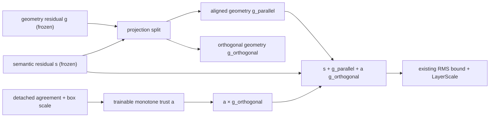

# Semantic-Orthogonal Monotone Geometry Trust (SMOGT)

## Triggering evidence

The complete independent SMGT G2R1 inventory evaluated every actual updated
snapshot. It selected no strict checkpoint. AP and AP-small were generally
non-decreasing, while one or more fixed-threshold Precision, Recall, or
max-F1 Precision values decreased by small amounts. Frozen stock and inherited
adapter hashes remained unchanged, the geometry budget stayed far from its
lower bound, and no numerical failure occurred. The failure is therefore a
feature-interference issue, not an OOM, checkpoint, or saturation issue.

## Minimal architecture repair

Let `s` be the inherited semantic residual, `g` be the inherited geometry
residual, and `a` be the existing trainable scale-monotone geometry budget.
SMOGT decomposes geometry relative to the semantic direction per query:

```text
g_parallel = (<g,s> / max(||s||^2, eps)) s
g_orthogonal = g - g_parallel
r_SMOGT = s + g_parallel + a * g_orthogonal
```

The zero-semantic case is defined as `g_parallel = 0` and
`g_orthogonal = g`. The existing RMS bound, writeback mask, LayerScale,
geometry-trust MLP, monotone scale prior, optimizer, loss, query count, and
decoder remain unchanged.



## Why this targets the measured regression

SMGT previously used `s + a*g`. Because `a < 1`, it attenuated both the
geometry component that agrees with semantic evidence and the component that
does not. SMOGT preserves the aligned component exactly and lets the existing
trained gate suppress only cross-task-conflicting geometry. Thus it directly
targets the observed threshold Precision/Recall regressions without removing
the AP/AP-small benefit or making the module an inert identity.

## Research relationship and distinction

The repair uses the task-conflict observation from [TSD, CVPR 2020](https://openaccess.thecvf.com/content_CVPR_2020/html/Song_Revisiting_the_Sibling_Head_in_Object_Detector_CVPR_2020_paper.html)
and the factorized task/scale treatment in [Dynamic Head, CVPR 2021](https://openaccess.thecvf.com/content/CVPR2021/html/Dai_Dynamic_Head_Unifying_Object_Detection_Heads_With_Attentions_CVPR_2021_paper.html).
It does not copy either design: SMOGT adds no proposal branches, no attention
blocks, no task head, no loss, and no inference procedure. It is a single
per-query vector projection inside the pre-existing RT-DETR decoder adapter;
the only learned tensors are still the original monotone geometry-trust MLP.

## Safety and acceptance protocol

- Unit tests prove exact reconstruction, semantic orthogonality, and the
  zero-semantic fallback.
- Counterfactual diagnostic modes retain their original semantics; the normal
  training path alone uses SMOGT.
- Every epoch records the parallel and orthogonal geometry component summaries
  beside the frozen-tensor hash and gate statistics.
- Run a fresh `g1r` 3-epoch screen and enumerate all updated snapshots.
- Only a strict selected G1R checkpoint may start independent `g2r2` 10-epoch
  feasibility training; only a strict selected G2R2 checkpoint may start
  fresh, resumable `formalr` 100-epoch training.
