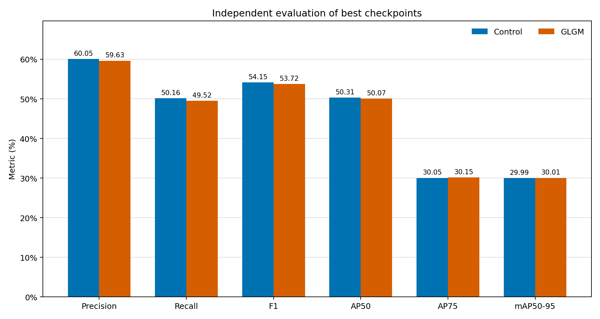
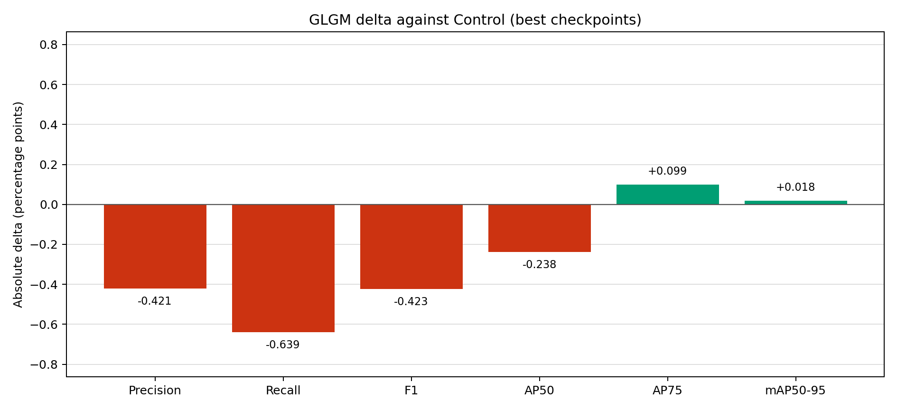
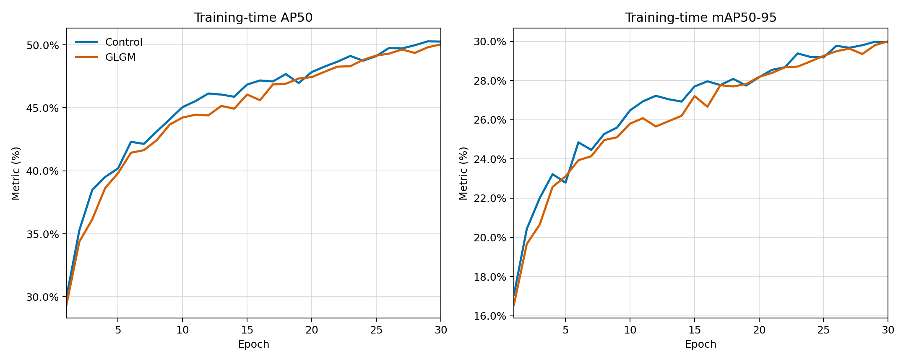
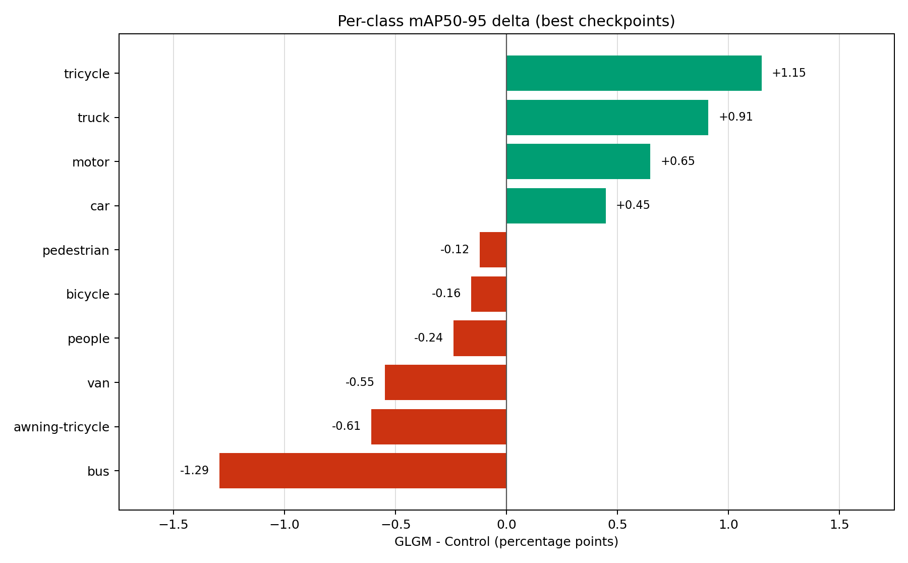
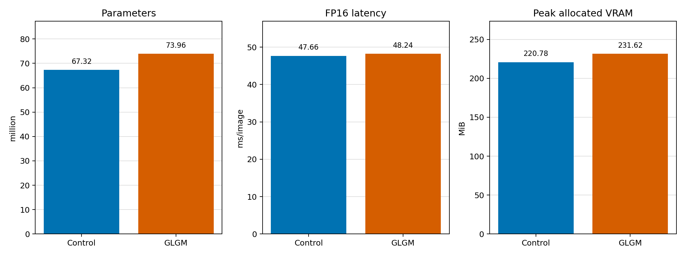

# GLGM Screen30 严格配对实验最终报告

## 结论

本次单随机种子 Screen30 **不支持 GLGM 是有效改进**。

在统一独立评估的 best checkpoint 上，GLGM 的 mAP50-95 仅提高 **0.018 pp**，AP75 提高 **0.099 pp**；但 Precision、Recall、F1 和 AP50 分别下降 **0.421、0.639、0.423、0.238 pp**。与此同时，参数量增加 **9.86%**，FP16 平均推理延迟增加 **1.21%**，峰值显存增加 **4.91%**。

该结果应视为“创新有效性未获支持”，不能把接近数值噪声水平的 mAP50-95 正增益表述为成功。由于目前只有 seed 0，也不能对微小差值作显著性声明。

## 实验协议

- 数据集：VisDrone，train 6471 张，val 548 张、38,759 个验证目标
- 对照组：RT-DETR-X Control
- 实验组：RT-DETR-X + GLGM
- 训练：30 epochs，640x640，batch 4，seed 0
- 配对：`STRICT_PAIR=1`、`PARALLEL=0`
- 设备：两组依次在同一张 RTX 4090 GPU 0 上运行
- 初始化：公共状态 SHA-256 为 `325E80C7FA9826028169F1D99071C09DA1C900FBABB029CBE43B675C151F6BE3`
- 训练结果：两组共 60 行逐轮记录，epoch 均为 1..30 且全部数值有限
- 评估：训练结束后对 best/last checkpoint 分别执行统一独立评估
- benchmark：best checkpoint，FP16，batch 1，warmup 50，正式迭代 200 次

## Best Checkpoint 核心指标

| 指标 | Control | GLGM | 绝对变化 | 相对变化 |
|---|---:|---:|---:|---:|
| Precision | 60.049% | 59.629% | -0.421 pp | -0.70% |
| Recall | 50.160% | 49.521% | -0.639 pp | -1.27% |
| F1 | 54.146% | 53.723% | -0.423 pp | -0.78% |
| AP50 | 50.309% | 50.072% | -0.238 pp | -0.47% |
| AP75 | 30.047% | 30.146% | +0.099 pp | +0.33% |
| mAP50-95 | 29.993% | 30.011% | +0.018 pp | +0.06% |





## Last Checkpoint 稳健性核对

| 指标 | Control | GLGM | 绝对变化 | 相对变化 |
|---|---:|---:|---:|---:|
| Precision | 59.267% | 59.629% | +0.362 pp | +0.61% |
| Recall | 50.284% | 49.521% | -0.763 pp | -1.52% |
| F1 | 53.902% | 53.723% | -0.178 pp | -0.33% |
| AP50 | 50.290% | 50.072% | -0.218 pp | -0.43% |
| AP75 | 30.109% | 30.146% | +0.037 pp | +0.12% |
| mAP50-95 | 29.982% | 30.011% | +0.029 pp | +0.10% |

best 和 last 的方向基本一致：GLGM 没有形成稳定、成体系的总体收益。

## 训练过程

GLGM 前期收敛慢于 Control，后期逐渐追平；到 30 epoch 时两者 mAP50-95 几乎重合。该轨迹更接近“增加容量后追平基线”，而不是产生清晰的新上界。



## 分类别结果

best checkpoint 的分类别 mAP50-95 中，GLGM 在 4/10 类上提高，在 6/10 类上下降：

- 提高：tricycle `+1.15 pp`、truck `+0.91 pp`、motor `+0.65 pp`、car `+0.45 pp`
- 下降：bus `-1.29 pp`、awning-tricycle `-0.61 pp`、van `-0.55 pp`、people `-0.24 pp`、bicycle `-0.16 pp`、pedestrian `-0.12 pp`

收益集中于少数类别，且 bus 等类别的退化抵消了正向变化，说明当前全局-局部融合缺少稳定的类别与尺度适应性。



## 效率代价

| 指标 | Control | GLGM | 变化 |
|---|---:|---:|---:|
| 参数量 | 67.324 M | 73.963 M | +6.639 M / +9.86% |
| FP16 平均延迟 | 47.664 ms | 48.241 ms | +0.577 ms / +1.21% |
| FP16 P95 延迟 | 48.038 ms | 49.079 ms | +1.042 ms / +2.17% |
| 吞吐率 | 20.980 FPS | 20.729 FPS | -1.20% |
| 峰值分配显存 | 220.78 MiB | 231.62 MiB | +4.91% |



## 失败原因判断

1. 当前 GLGM 增加了约 9.86% 参数，但没有带来相称的总体检测增益，模块容量与任务收益不匹配。
2. 训练曲线显示 GLGM 主要在弥补早期收敛差距，最终只追平 Control，没有形成稳定领先。
3. 分类别增益高度不均匀，说明固定的全局-局部融合对不同密度、尺度和类别场景缺少自适应约束。
4. Recall、F1 和 AP50 同时下降，表明改善少数高 IoU 或特定类别样本的代价是整体检出能力下降。

## 限制

- 当前只有 seed 0，无法估计方差或统计显著性；因此 `+0.018 pp` mAP50-95 不能视为可靠提升。
- 锁定评估器没有输出 AP-tiny/AP-small。本报告不从类别 AP 或总体 AP 反推尺度指标，避免制造不可复核数据。
- CUDA 对部分算子给出 deterministic warn-only 警告，不能宣称跨次训练逐位一致。
- 延迟 benchmark 虽为严格同机同协议，但仍建议重复独立运行后报告均值和方差。

## 后续决策

不建议直接把当前 GLGM 配置扩展到 100 epoch 或多随机种子正式实验。更合理的顺序是先进行低成本结构修订：减少冗余分支参数、引入尺度条件门控、检查融合位置，并设置明确的 Screen 门槛。只有在多次短程筛选中同时改善 mAP50-95、Recall 和效率后，再进入三随机种子正式验证。

## 产物说明

- `FINAL_REPORT.json`：机器可读最终结论、best/last 指标、benchmark 和限制
- `core-metrics-best.csv`、`core-metrics-last.csv`：核心指标对比
- `training-curves.csv`：两组 30 轮对齐曲线
- `per-class-delta-best.csv`：分类别指标变化
- `efficiency.csv`：参数、延迟、FPS 和显存对比
- `control-results.csv`、`glgm-results.csv`：原始逐轮训练数据
- `raw/`：独立评估、benchmark、训练收据、协议和数据审计 JSON
- `SHA256SUMS.txt`：发布包文件校验和
- `generate_final_report.py`：从原始证据重新生成 JSON、CSV 和图表

本目录不包含任何 `.pt` 模型检查点。原始收据中的 checkpoint 路径和 SHA-256 仅为审计元数据。

重新生成派生文件：

```bash
python generate_final_report.py
```
