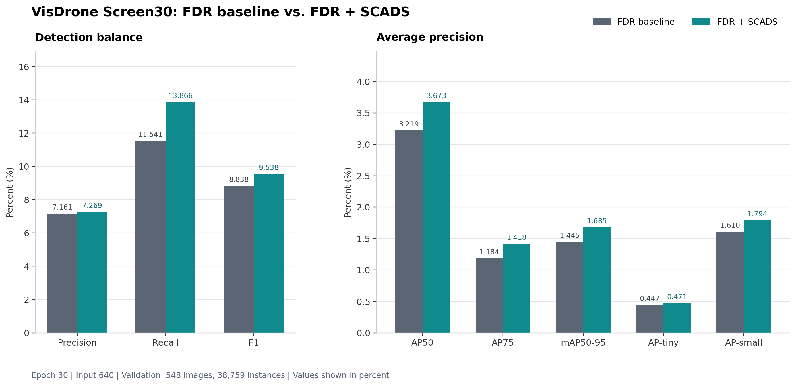

# SCADS/FDR VisDrone Screen30 实验报告

本目录包含 FDR 与 SCADS 严格配对实验的不可变 Gate 报告，以及由该报告生成的可复现分析数据和图表。

## 核心结果

SCADS 在统一独立评估中的全部检测指标均有提升。主要增益来自 Recall（+2.325 个百分点）、AP75（+0.234 个百分点）和 mAP50-95（+0.240 个百分点）。F1 根据报告中的 Precision 和 Recall，按 `2PR/(P+R)` 计算。

| 指标 | FDR | FDR + SCADS | 绝对变化 | 相对变化 |
|---|---:|---:|---:|---:|
| Precision | 7.161% | 7.269% | +0.108 pp | +1.51% |
| Recall | 11.541% | 13.866% | +2.325 pp | +20.15% |
| F1 | 8.838% | 9.538% | +0.700 pp | +7.92% |
| AP50 | 3.219% | 3.673% | +0.455 pp | +14.13% |
| AP75 | 1.184% | 1.418% | +0.234 pp | +19.74% |
| mAP50-95 | 1.445% | 1.685% | +0.240 pp | +16.62% |
| AP-tiny | 0.447% | 0.471% | +0.025 pp | +5.52% |
| AP-small | 1.610% | 1.794% | +0.184 pp | +11.42% |




## Gate 结论

- Gate 通过：`false`
- Formal100 可执行：`false`
- 通过门检项：`8/9`
- 未通过项：`tiny_saturation_reduction_ge_50pct`
- 实测 tiny 饱和率相对下降：`30.47%`

因此实验停止在 Screen30，未启动 Formal100。

## 效率代价

| 指标 | FDR | FDR + SCADS | 变化 |
|---|---:|---:|---:|
| 参数量 | 33,156,614 | 33,174,025 | +17,411 |
| 中位延迟 | 63.620 ms | 67.201 ms | +3.581 ms |
| 推理速度 | 15.718 FPS | 14.881 FPS | -0.838 FPS |

## 文件说明

- `gate-report.json`：完整且不可变的评估器输出。
- `core-metrics.csv`：Precision、Recall、F1、AP50、AP75、mAP50-95、AP-tiny 和 AP-small。
- `training-windows.csv`：最后一轮和最后三轮平均训练指标。
- `efficiency-metrics.csv`：参数量、检查点大小、延迟和 FPS。
- `mechanism-metrics.csv`：饱和率、路由、oracle 和重建相关机制指标。
- `experiment-context.csv`：数据集、硬件和评估设置。
- `core-metrics-comparison.png`：核心指标配对对比图。
- `generate_assets.py`：CSV、README 和图表的确定性生成脚本。

## 复现

```bash
python reports/scads-screen-v1/generate_assets.py reports/scads-screen-v1/gate-report.json
```

Gate JSON SHA-256：`7F86BD000CC12B8069941709BB8E04C8EF3F6E4E3A22F5B700DF52F92004002E`。
